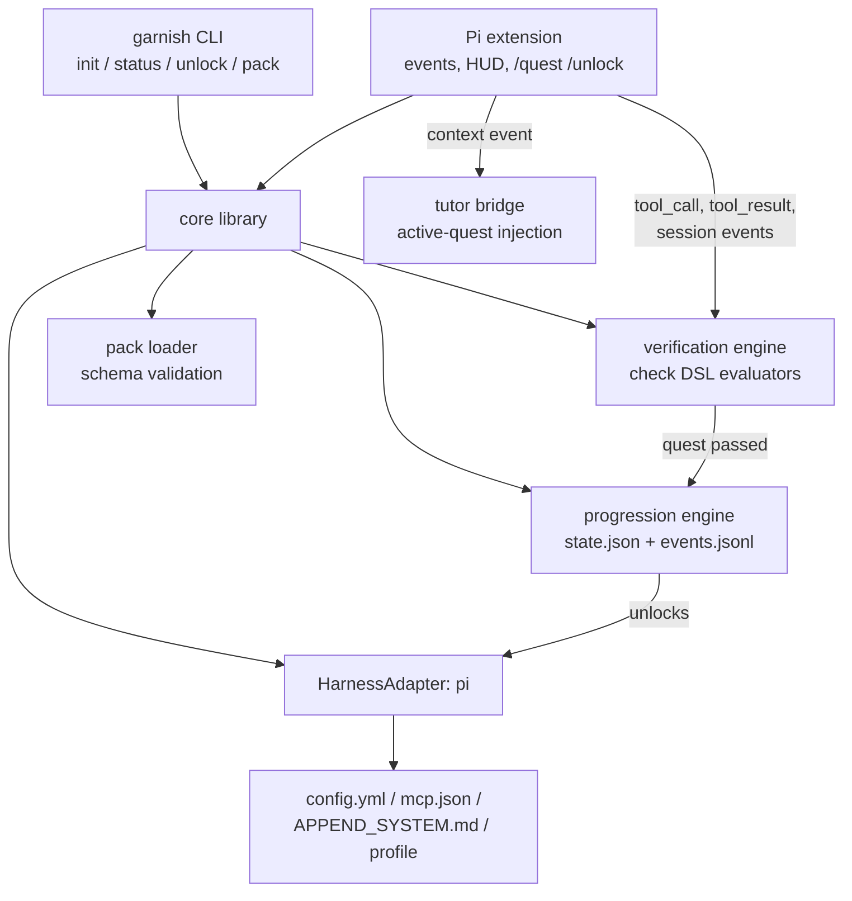

# ARD — Garnish

> Architecture requirements & decisions. Companion to [PRD](./prd.md).
> Status: draft v1 · 2026-07-01
> Harness facts below were verified against Pi's (Oh My Pi) published docs
> (`extensions`, `extension-loading`, `settings`, `skills`, `mcp-config`,
> `system-prompt-customization`) on 2026-07-01, pinned as the adapter contract.

## 1. Context and constraints

- Greenfield. No code exists.
- v1 targets **one harness: Pi**. The design must not *preclude* other harnesses, but
  proving portability is explicitly v2 (PRD non-goal).
- Local-first: no server, no accounts, no telemetry backend.
- Never fork or patch the harness. Everything rides public surfaces: config files,
  the extension API, documented env vars.
- The learner's machine may already have a configured harness. Garnish must be able
  to run fully isolated from that setup.

## 2. Verified harness surface (adapter ground truth)

What Pi actually exposes, and what Garnish builds on. This section is the **adapter
contract**; CI pins it against a specific Pi version (see §9).

### 2.1 Extension API

Extensions are TS/JS modules exporting a default factory `(pi: ExtensionAPI) => void`,
loaded from `~/.omp/agent/extensions/`, `<cwd>/.omp/extensions/`, a settings
`extensions:` array, or plugins. In-process, not sandboxed.

Relevant capabilities:

| Capability | API | Garnish use |
|---|---|---|
| Lifecycle events | `session_start`, `session_shutdown`, `agent_start/end`, `turn_start/end` | quest triggers, "first reply" detection |
| Tool observation | `tool_call` (pre, can block), `tool_result` (post) | event-driven verification; L0 tool blocking |
| Per-call context rewrite | `context` event | inject active quest into every model call |
| Message injection | `before_agent_start`, `sendMessage`/`sendUserMessage` (`deliverAs: steer\|followUp\|nextTurn`) | celebrations, nudges |
| Runtime tool gating | `getActiveTools` / `setActiveTools` | live unlock of tools mid-session |
| Slash commands | `registerCommand` | `/quest`, `/unlock`, `/garnish` |
| HUD | `ctx.ui.setWidget` (above/below editor, ≤10 lines), `setStatus`, `notify` | quest log widget, status line, completion toasts |
| Dialogs | `ctx.ui.confirm/select/input` | onboarding confirmations in-session |
| Session persistence | `pi.appendEntry(customType, data)`; rebuild via `ctx.sessionManager.getBranch()` | mirror quest events into the session record |
| Session control | `reload()`, `newSession`, `switchSession`, `waitForIdle` | apply config-baked unlocks without manual restart |
| Headless degrade | `ctx.ui` no-ops when headless | L6 automation quests keep verifying; HUD silently absent |

### 2.2 Config gates (hard gating surface)

Settings live at `~/.omp/agent/config.yml` (global) and `<cwd>/.omp/config.yml`
(project, cwd-only). Arrays replace wholesale across layers — Garnish must own any
array it manages. `omp config get/set` exists for scripting.

| Gate | Mechanism | Live-apply? |
|---|---|---|
| Built-in tools | per-tool toggles (`bash.enabled`, `eval.py/js`, `browser.enabled`, `web_search.enabled`, …) + `setActiveTools` at runtime | **Yes** (runtime path) |
| Approval mode | `tools.approvalMode` (always-ask / write / yolo) | session reload |
| Skills | `skills.enabled`, `includeSkills` allowlist globs, `ignoredSkills`, `skills.customDirectories` | **Reload** — skills list is baked into the system prompt at session start |
| MCP servers | Garnish owns `~/.omp/agent/mcp.json` + `disabledServers` denylist; `mcp.enableProjectConfig` gates project-level `.omp/mcp.json` | `/mcp reload` in-product |
| Extensions/plugins | `disabledExtensions` (`extension-module:<name>`, `skill:<name>`) | session reload |
| Context discovery | `disabledProviders` (also gates AGENTS.md-style discovery sources) | session reload |


**Isolation and version control:** Garnish does not rely on the learner's global `omp`
binary. The CLI installs a certified Pi build into Garnish-owned runtime storage and
launches that binary explicitly. `PI_CODING_AGENT_DIR` points sessions/config at
Garnish-owned agent storage, so existing user harness config is untouched. Tests use the
same mechanism with a temp agent dir. `omp --profile` remains a documented Pi option,
but Garnish does not need it for v1 isolation.

### 2.3 System prompt seams

- `APPEND_SYSTEM.md` (`~/.omp/agent/` or `<cwd>/.omp/`) appends a verbatim block while
  keeping all defaults (including the skills list). → static tutor framing.
- `SYSTEM.md` *replaces* the leading prompt block and loses tools/skills guidance.
  → **avoid; never used by Garnish.**
- Dynamic, per-call content goes through the extension `context` event. → active quest.

## 3. Decisions (ADR style)

### ADR-1: Ship as Pi extension + thin CLI, not a wrapper process

**Decision.** Garnish is two artifacts sharing one core library: a Pi **extension**
(quest engine, verification, HUD, unlock application — everything session-scoped) and
a **CLI** (`garnish init|status|unlock|pack` — everything outside a session).

**Rationale.** The extension API delivers exactly what a tutor needs: pre/post tool
events (no transcript scraping), per-call context injection (no prompt-file rewriting
races), live tool gating, native UI surfaces, and `reload()` for config-baked changes.
A PTY-wrapper or log-tailing sidecar would rebuild all of that with worse fidelity and
constant drift risk.

**Alternatives rejected.**
- *Fork the harness*: maximal power, permanent maintenance tax, violates the PRD.
- *PTY wrapper*: fragile terminal parsing, breaks on every TUI change, can't inject
  context cleanly.
- *Log/transcript tailer*: read-only, latency between action and verification, brittle
  format coupling — the `tool_call`/`tool_result` events make it strictly worse.

**Consequence.** The extension runs in-process and unsandboxed: a Garnish crash is a
harness crash. Every event handler wraps in a top-level try/catch; verification work
is queued off the hot path; failure degrades to "quests pause" rather than breaking
the session.

### ADR-2: `HarnessAdapter` seam, one implementation

**Decision.** All Pi-specific knowledge (certified runtime install path, config keys,
event names, dir layout, `PI_CODING_AGENT_DIR` mechanics) lives behind one interface;
curriculum, progression, and verification logic never import it directly.

```ts
interface HarnessAdapter {
  id: "pi";                                     // adapter identity
  certifiedVersion: string;                     // exact Pi version this Garnish release supports
  ensureRuntime(): RuntimeInfo;                 // install/verify Garnish-owned Pi binary
  provision(): void;                            // config.yml, mcp.json, APPEND_SYSTEM.md, extension install
  verifyRuntime(): VersionHandshake;            // pause quests on mismatch, never fail open
  applyGates(unlocked: FeatureId[]): GateResult; // returns which gates applied live vs need reload
  featureFidelity(f: FeatureId): "hard" | "soft"; // all v1 features: "hard"
  stockConfig(): ConfigSnapshot;                // for unlock --all equivalence
}
```

**Rationale.** The seam costs little now (one implementation, deep interface) and is
the difference between "port to Claude Code" being a v2 feature vs a rewrite. Deletion
test: remove it and Pi key names smear across every module.

### ADR-3: Event-driven verification with declarative check DSL

**Decision.** Quests declare checks in a small closed DSL; the verification engine
evaluates them from two sources: **live extension events** (primary) and **on-demand
probes** (fs/json-path/git/command/mcp-handshake) run at quest activation, on
`turn_end`, and on `/quest check`.

Check types (v1, closed set): `event` (match on tool/session event predicates; supports
simple `after:` and `sameSession:` predicates, not arbitrary workflow scripts),
`file_exists`, `json_path`, `yaml_path`, `command` (exit code + stdout regex),
`git` (predicates: commit_count, clean_tree, branch_exists), `mcp_handshake`,
`skill_valid` (frontmatter parse + discovery check), `confirm` (explicit user
self-confirmation via `ctx.ui.confirm`; capstone checklist items that no artifact can
prove).

**Rationale.** Deterministic, testable both directions (pass on genuine completion,
fail on absence), no NLP on user behavior. Events give sub-second feedback (PRD:
auto-complete within 10s); probes cover state produced outside a session (e.g. the
user edited a file in their editor). The capstone is a *composition* of these checks —
a deterministic checklist — per the PRD's resolved open question 3.

**Inventory-driven constraints.** The v1 quest inventory requires only simple event
co-occurrence/ordering, so the DSL deliberately stops at `after:` / `sameSession:`.
Approval-denied checks are optional until the Pi spike confirms event visibility.
Precise usage/context counters belong to Hard Mode's future `usage_stat` check, not the
core pack.

**v2 candidates (PRD "New Game+ — Hard Mode"), deliberately absent from the v1 set:**
`usage_stat` (assert on real session token/cache/cost counters — needs an adapter
seam for Pi's usage surface), `quiz` (fixed-answer knowledge check), `rubric`
(LLM-graded; still contentious). The closed set only grows by ADR amendment.

**Alternatives rejected.** Arbitrary JS verifiers in packs (unsandboxed code from
third-party packs inside the harness process — unacceptable); LLM judging anywhere in
v1 (nondeterministic, slow, costs money, teaches users to game prose).

### ADR-4: Progression state = snapshot + append-only event log

**Decision.** Under the Garnish-owned agent dir (`PI_CODING_AGENT_DIR`):
`garnish/state.json` (derived snapshot) + `garnish/events.jsonl` (source of truth;
every quest event, unlock, XP award appended). Snapshot is a pure fold of the log;
corruption/deletion recovers by replay. The extension additionally mirrors quest
completions into the session via `appendEntry` so session views show them inline.

**Rationale.** Crash-safe (append-only), auditable, replayable (PRD criterion 9),
trivially testable. A SQLite dependency buys nothing at this scale.

### ADR-5: Gating = generated config + runtime enforcement, monotonic

**Decision.** Garnish *owns* the generated config surfaces under its isolated agent dir
(config.yml tool toggles, `includeSkills`, mcp.json + `disabledServers`,
`disabledExtensions`). Unlock application order: (1) rewrite config, (2) apply live
via `setActiveTools` when the feature is runtime-gateable, else (3) offer one-keypress
`reload()`. L0 additionally blocks stray tool calls via the `tool_call` pre-event
(belt-and-suspenders, with a friendly "not unlocked yet — current quest: …" message).
Unlocks are monotonic; `garnish unlock --all` must produce effective-config parity
with a stock install (snapshot-tested).

**Consequence.** Because settings arrays replace wholesale, user hand-edits to
Garnish-owned arrays get clobbered on regeneration. Mitigation: Garnish-owned files
carry a generated-header warning; the learner's global Pi config is never read or
rewritten.

### ADR-6: Quest packs are data; core pack ships in-repo

**Decision.** A pack is a directory: `pack.yml` (id, version, `requires:` adapter
features, level graph) + one `QUEST.md` per quest (frontmatter: id, level, xp,
required, prereqs, `unlocks:`, `checks:`; body: instructions + hints in prose).
Markdown-with-frontmatter deliberately mirrors the skill format — by the time a user
finishes L3 they have already internalized the authoring shape. Packs are validated
against a published JSON schema at load; invalid packs are rejected with line-level
errors, never half-loaded.

**Decision detail — schema sketch (decision-rich parts only):**

```yaml
# QUEST.md frontmatter
id: connect-agent
level: 0
xp: 20
required: true
prereqs: [install-harness]
unlocks: []            # feature ids; level completion computes the union
checks:
  - type: event
    match: { event: agent_end, min_assistant_turns: 1 }
  - type: json_path
    file: "{agent_dir}/config.yml"
    path: $.providers[*].apiKeyRef
    assert: exists
```

### ADR-7: Tutor bridge = static append + dynamic context injection

**Decision.** Two seams, split by change rate. Identity ("Garnish is active; you are
also the tutor; never mark quests complete yourself — verification is mechanical")
goes in `APPEND_SYSTEM.md` at provision time. The active quest payload (quest text,
checks, hint policy, current progress) is injected per model call by the extension's
`context` handler — bounded to ~1KB so it never crowds real work.

**Rationale.** `APPEND_SYSTEM.md` survives everything but changes only on provision;
the `context` event changes every quest without touching disk or restarting. The agent
can always answer "what's my quest?" groundedly (PRD criterion 7). The
"never self-certify" instruction closes the obvious failure mode of the agent
declaring victory.

### ADR-8: TypeScript, single package, Bun toolchain

**Decision.** One repo, one package, three entry points (`cli.ts`, `extension.ts`,
shared `core/`). TypeScript because the extension API is TS; Bun for test/build (fast,
zero-config TS). No framework for the CLI beyond a minimal arg parser; TUI needs are
served by Pi's own UI APIs in-session and plain text out-of-session.

### ADR-9: Certified Pi runtime, no global dependency

**Decision.** Garnish installs a specific certified Pi version into Garnish-owned
runtime storage and launches that binary explicitly. The learner's global `omp` on
`PATH` is ignored. The installed extension performs a startup handshake against the
certified version recorded in `HarnessAdapter.certifiedVersion`; if the version differs,
quests pause and the HUD/`garnish doctor` explain how to repair. Garnish releases are
the update channel: a newer Pi reaches learners only when a Garnish release certifies it
with adapter-contract tests.

**Rationale.** Profile isolation protects config, not binaries. Owning the binary is the
only way to prevent unwanted upstream updates from breaking learners mid-curriculum.
This makes Garnish behave like a game: the engine version is bundled/certified with the
content, and upgrades happen through the game launcher.

**Consequences.** Disk use is higher and `garnish init` must implement an installer, but
support gets simpler: every bug report includes a Garnish version plus a certified Pi
version. `garnish eject` is the escape hatch after credits roll: copy the learner's
config/skills/MCP loadout into a standalone Pi setup if they want to leave the managed
runtime.

## 4. Component model



Component responsibilities, one line each:

- **CLI** — onboarding wizard (≤5 prompts: model/key, speedrun-mode offer, sandbox dir,
  profile choice), `status`/`quest` rendering, `unlock` escape hatch (+ `cheat` alias),
  `pack` validate/add.
- **Extension** — subscribes to events, feeds the verification engine, renders HUD
  (widget + status line + notify), registers slash commands, injects tutor context,
  applies live unlocks, calls `reload()` for config-baked ones.
- **Progression engine** — folds events.jsonl → state; computes level/XP/unlock set as
  pure functions; emits `unlock` events.
- **Verification engine** — evaluates a quest's checks against live events + probes;
  debounced on `turn_end`; marks pass/fail with captured evidence.
- **Pack loader** — discovers packs (core in-repo, extras under
  `{agent_dir}/garnish/packs/`), schema-validates, builds the quest/level graph,
  rejects cycles and unknown feature ids.
- **Pi adapter** — the only module that knows Pi's certified runtime path, key names,
  paths, env vars, and `PI_CODING_AGENT_DIR` mechanics.

## 5. Key flows

### 5.1 Onboarding (`garnish init`)

1. `ensureRuntime()` installs/verifies the Garnish-certified Pi build in
   Garnish-owned runtime storage; the learner's global `omp` is ignored.
2. Wizard: provider/key (first-class Anthropic + OpenAI env-var paths; manual
   local/other path), speedrun mode (experienced users: `unlock --level N` skip,
   Speedrunner badge still earnable), sandbox directory (a git repo Garnish scaffolds —
   quests operate there, not on real projects, until the user opts out).
3. Adapter `provision()`: write gated config.yml, empty-but-owned mcp.json,
   `APPEND_SYSTEM.md`, install extension, write initial state (L0 active), and set
   `PI_CODING_AGENT_DIR` for launched sessions.
4. Launch certified Pi binary; extension `session_start` fires; version handshake must
   pass before quests run; HUD shows "Tutorial Island — Level 0" quest log.

### 5.2 Quest completion (example: "connect your agent")

1. User configures a key (wizard did it) and sends a first message.
2. Extension sees `agent_end` with ≥1 assistant turn → event check satisfied;
   `json_path` probe confirms key ref exists.
3. Verification engine marks quest passed → progression engine appends event, awards
   XP → `notify` celebration + widget update; `appendEntry` mirrors into session.
4. If the pass completes L0: unlock set expands; `setActiveTools` applies file/shell
   tools live; HUD announces Level 1.

### 5.3 Unlock requiring reload (Skill Tree, L3)

1. L2 completes → `includeSkills` allowlist written to config.
2. Skills list is baked at session start → extension prompts: "Level 3 unlocked:
   Skill Tree (skills). Reload to pick them up? [Enter]" → `reload()`.

## 6. Security posture

- Packs are data, never code (ADR-3). The only executable surface a pack touches is
  the `command` check, which runs a *pack-declared* command — core pack only in v1;
  third-party packs get a load-time warning listing every `command` check before first
  activation.
- Secrets: key material referenced by env-var name (matches Pi's `${VAR}` indirection
  in mcp.json); Garnish never persists raw keys (house rule and PRD non-goal).
- Sandbox-first: quests target a scaffolded git repo, so approval-mode lessons and
  destructive-command mistakes land in disposable territory.
- The extension is unsandboxed by platform design; Garnish ships no network calls at
  all in v1 (pack installs are file/git operations the user runs).

## 7. Risks

| Risk | Severity | Mitigation |
|---|---|---|
| Pi API/config drift breaks adapter | High | pinned Pi version; adapter contract test in CI (§9); single-module blast radius (ADR-2) |
| In-process extension crash kills session | High | try/catch every handler; verification off hot path; degrade to "quests paused" banner |
| Wholesale array replace clobbers user config edits | Med | Garnish owns only generated files in its profile; generated-header warnings; never touch non-owned keys |
| Gating frustrates experienced users | Med | speedrun mode at onboarding; `unlock`/cheat code always available; L0→L1 tuned to <10 min |
| Agent "helps" by doing quests for the user | Med | tutor framing forbids it; checks verify *user-visible outcomes* (e.g. approval-mode quest requires an approval dialog event, which only user interaction produces) |
| LLM nondeterminism makes event checks flaky | Med | checks assert outcomes (file exists, commit made), not agent behavior paths |
| Headless mode hides HUD (L6) | Low | by design: verification is UI-independent; L6 quest text says so |

## 8. Milestones (build order)

1. **M0 — skeleton:** repo, core types, pack schema + loader, progression fold,
   verifier matrix vs fixtures. Pure library, fully unit-tested, no Pi.
2. **M1 — adapter + CLI:** Pi adapter (certified runtime install, provision/gates/
   stock-parity/version-handshake), `init` wizard, `status`, `doctor`. E2E: hermetic
   init via `PI_CODING_AGENT_DIR`.
3. **M2 — extension:** event wiring, HUD, `/quest` `/unlock`, live `setActiveTools`,
   `reload()` flow, tutor `context` injection. First live L0→L1 walkthrough.
4. **M3 — core pack L0–L3:** onboarding, core loop, context, skills quests + checks.
5. **M4 — core pack L4–L7:** MCP, subagents, automation, capstone; third-party pack
   loading; polish (celebrations, streak-free resume pointer).
6. **M5 (v2) — Hard Mode pack:** NG+ chapters per PRD; requires `usage_stat` + `quiz`
   check types and recorded-trace scenario fixtures for Boss Rush. Not scheduled.

## 9. Test strategy

Mirrors the PRD proof plan; the architecture adds:

- **Adapter contract test:** a CI job against the pinned Pi version asserting every
  §2 fact Garnish relies on (event names fire, config keys gate, `setActiveTools`
  round-trips, profile env isolates). Drift fails this job, not a learner's session.
- **Extension harness:** a fake `ExtensionAPI` (event emitter + recorded `ctx.ui`
  calls) so quest flows run as fast unit tests; recorded real-event fixtures keep the
  fake honest.
- **Stock-parity snapshot:** `unlock --all` config vs fresh stock install config,
  diffed structurally (not textually) so cosmetic reordering doesn't flake.
