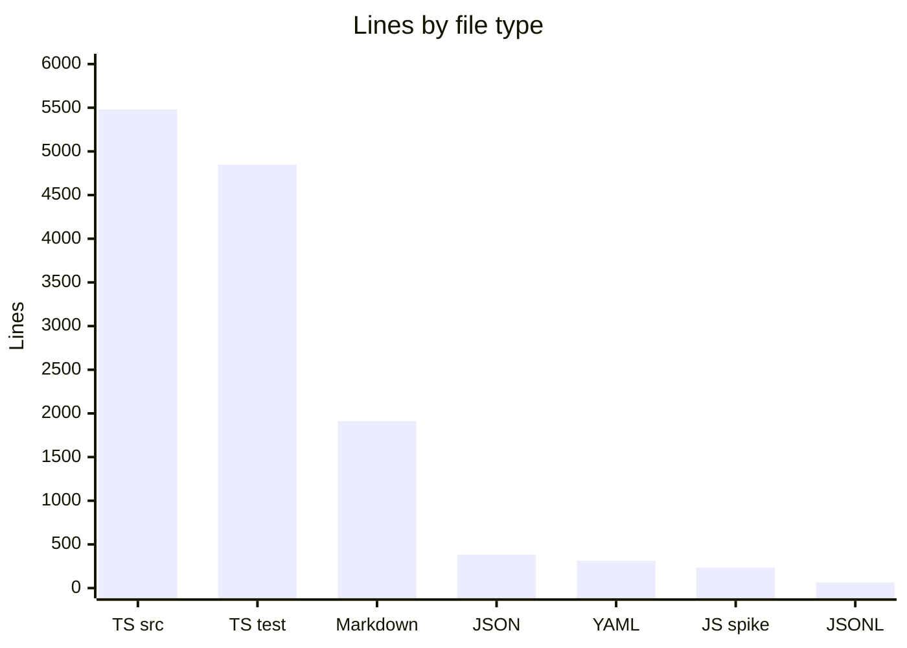
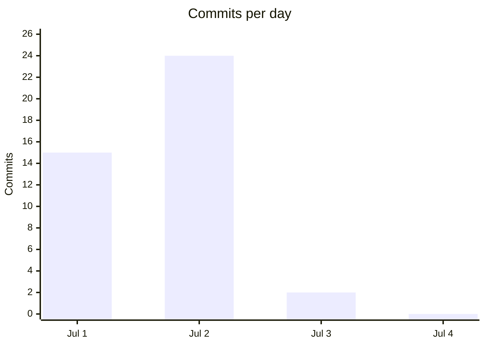

# By the numbers

Data collected on 2026-07-04.

Garnish is four days old (first commit Jul 1, 2026) and already at milestone M2 with three quest packs shipping. This page is a snapshot of size, activity, and complexity taken from the git tree and source files on the date above.

## Size

The repo is TypeScript-dominant, split almost evenly between source and tests. Markdown carries the curriculum (quest packs) and docs; YAML, JSON, and JSONL hold config and recorded event fixtures.

| Type | Files | Lines | Role |
|---|---|---|---|
| TypeScript source | 28 | 5481 | `src/` engine and adapters |
| TypeScript test | 20 | 4850 | `tests/` unit and E2E |
| Markdown | 37 | 1911 | quest packs (`packs/`) and docs |
| JSON | 5 | 383 | `package.json`, schemas, fixtures |
| YAML | 11 | 313 | `pack.yml`, CI workflows, config |
| JavaScript | 1 | 236 | `spikes/pi-extension-api/index.js` probe |
| JSONL | 7 | 63 | recorded event captures, E2E fixtures |

Test lines track source lines at a near 1:1 ratio: 4850 test lines against 5481 source lines (0.89:1). For a four-day repo that ratio is high, and it reflects the verifier matrix and fixture-driven proof plan in `docs/prd.md`.

File counts: 28 source files, 20 test files, 24 config and fixture files (11 YAML, 5 JSON, 7 JSONL, plus `bunfig.toml`).

## Activity

41 commits across three active days (Jul 1, Jul 2, Jul 3), with Jul 2 carrying more than half the history.

| Date | Commits | Milestone |
|---|---|---|
| 2026-07-01 | 15 | M0 (scaffold, core schemas, loader, verifier, progression) |
| 2026-07-02 | 24 | M1 and M2 (CLI, packs L0 to L2, extension, HUD, tutor, E2E, live fixes) |
| 2026-07-03 | 2 | v2 planning docs stamped in tracker |
| 2026-07-04 | 0 | data collection day |

The build pace is the headline: M0 through M2 landed in roughly two days. The most touched file is `docs/agents/issue-tracker.md` (16 touches), because every wave shipped a tracker update alongside the code.

Most actively changed files (touches in the last 90 days, which covers all history):

| File | Touches |
|---|---|
| `docs/agents/issue-tracker.md` | 16 |
| `src/index.ts` | 6 |
| `src/extension.ts` | 5 |
| `src/verifier/index.ts` | 4 |
| `src/cli.ts` | 4 |
| `package.json` | 4 |
| `src/extension/index.ts` | 3 |
| `src/cli/init.ts` | 3 |
| `src/adapter/gates.ts` | 3 |

## Bot-attributed commits

0. This is a solo project with no `Co-authored-by` bot trailers and no bot-authored commits in git history. That figure is a lower bound: it counts git attribution, not AI assistance during authoring.

## Complexity

The largest source files concentrate in the verifier, adapter, loader, and progression cores.

| File | Lines |
|---|---|
| `src/verifier/index.ts` | 936 |
| `src/adapter/gates.ts` | 612 |
| `src/loader/index.ts` | 456 |
| `src/progression/index.ts` | 429 |
| `src/cli/index.ts` | 368 |
| `src/cli/real.ts` | 330 |
| `src/extension/index.ts` | 304 |
| `src/extension/hud.ts` | 266 |
| `src/cli/init.ts` | 261 |
| `src/adapter/runtime.ts` | 219 |
| `src/core/checks.ts` | 218 |

Average source file size is about 196 lines (5481 lines across 28 files). `src/verifier/index.ts` is the complexity hotspot at 936 lines: it holds the whole check evaluation engine, the JSONPath parser, string and int predicate matchers, event field alias resolution, and the debounced scheduler in one module.

The dependency graph is layered, with `src/core/` as the base that imports nothing internal. The deepest import chain runs four layers: the entry points (`src/cli/real.ts`, `src/extension/index.ts`) import the adapter, the adapter imports progression (`src/adapter/gates.ts` pulls types from `src/progression/index.ts`), and progression imports core. See [architecture](overview/architecture.md) for the full component diagram.
