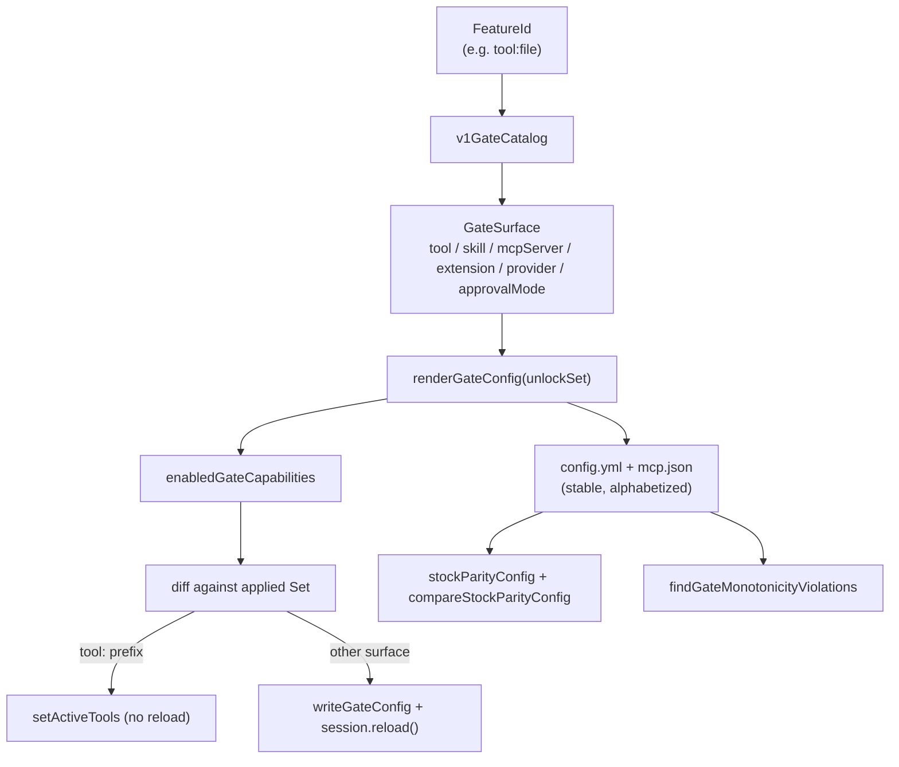

# Capability gating

Capability gating is how Garnish restricts harness features at the start and lifts them as the learner levels up. A gate catalog maps each feature ID to the Pi config surfaces that implement it (tools, skills, MCP servers, extensions, providers, approval modes). The renderer turns the current unlock set into a generated `config.yml` and `mcp.json`; the live unlock applier then applies fresh capabilities during a session, splitting tool capabilities (applied live without a reload) from config-baked surfaces (written then applied with a session reload). Unlocks are monotonic: capabilities are only ever added, never removed.

## How it works

### The gate catalog

`v1GateCatalog` in `src/adapter/gates.ts` is the single source of truth for which feature IDs exist and which Pi config surfaces each one controls. The feature IDs are:

- `context` (providers: `agents-md`, `claude`, `codex`, `cursor`, `gemini`, `github`, `opencode`)
- `extensions` (the `extension-module:garnish-demo` extension)
- `mcp` (the `garnish-demo` MCP server)
- `skills` (skill glob `*`)
- `subagents` (the `task` tool)
- `tool:bash`, `tool:file` (edit, glob, grep, read, write), `tool:shell`

The `native` provider is deliberately not gated. Disabling omp's native provider also disables the `$PI_CODING_AGENT_DIR/extensions` autoload, which would lock Garnish's own extension out of the session (observed live on omp 16.2.13 during the LOO-139 walkthrough). The catalog comment records this constraint.

### renderGateConfig

`renderGateConfig` takes a `ProgressionUnlockSet` and a catalog (default `v1GateCatalog`) and produces a `RenderedGateConfig` with both the parsed config data and the serialized `configYml` and `mcpJson` strings. It walks the catalog, builds the set of unlocked capabilities, then writes: tool enabled flags (e.g. `bash.enabled`), skill `includeSkills` globs, `disabledProviders`, `disabledExtensions`, `mcp.enableProjectConfig` plus `disabledServers`, and the strongest unlocked `tools.approvalMode`. Serialization is stable: keys are sorted alphabetically and regenerated deterministically on every render, with a `# Generated by Garnish` header marking the file as owned.

`writeGateConfig` writes the two files into the agent dir. When the effects provide a `readFile`, it merges by preserving non-owned top-level keys (such as a learner's `providers` block with `apiKeyRef`) while replacing Garnish-owned arrays wholesale. A path assertion guards against writes escaping the agent dir.

### The live-vs-reload split

The live unlock applier in `src/extension/unlocks.ts` turns unlock events into actual capability changes. On `session_start`, `turn_end`, or `agent_end` it folds the store, renders the gate config, and asks `enabledGateCapabilities` for the full set of enabled capabilities. It diffs that against an `applied` `Set` and returns early when nothing is fresh. Fresh capabilities are split by the `tool:` prefix:

- **Live tools** (capabilities starting with `tool:`) are merged into the session's active tools via `setActiveTools` (sorted, deduped with the current set). No reload.
- **Config-baked surfaces** (providers, skills, MCP, extensions, approval mode) are written with `writeGateConfig`, then the session is reloaded. State lives in the Garnish store, not session entries, so it survives the reload.

### Monotonic unlocks and stock parity

Capabilities are only ever added. Three layers enforce this. The `applied` `Set` in the live unlock applier only ever grows, so a reload or re-render cannot strip something already applied. `findGateMonotonicityViolations` verifies across a sequence of rendered configs that no capability disappears between renders. And `stockParityConfig` renders the fully-unlocked baseline (every catalog feature ID unlocked), which `compareStockParityConfig` checks against: every catalog surface must be enabled. This is the guarantee that `garnish unlock --all` produces a config equivalent to a fresh stock Pi install with no gating.

### The garnish unlock escape hatch

`garnish unlock --all` (alias `garnish cheat`, and the `/unlock --all` slash command in-session) appends `unlock` events with reason `cheat` for every level and feature, then triggers the live applier. It skips the curriculum without awarding XP. The Speedrunner badge stays earnable: a learner who later clears all the skipped required quests still gets it. See [CLI commands](../systems/cli/commands.md) and the [glossary](../overview/glossary.md) entry for "Cheat code".

## Key components

| Component | File | Role |
|-----------|------|------|
| Gate catalog | `src/adapter/gates.ts` | `v1GateCatalog` maps feature IDs to the Pi config surfaces that implement them. |
| Gate renderer | `src/adapter/gates.ts` | `renderGateConfig` turns an unlock set into `config.yml` and `mcp.json`; `writeGateConfig` writes and merges them. |
| Live unlock applier | `src/extension/unlocks.ts` | `registerLiveUnlocks` applies fresh capabilities, splitting tools (live) from config-baked surfaces (reload). |
| CLI unlock command | `src/cli/index.ts` | `unlockCommand` appends `unlock` events for `--all` / `--level`; the `garnish unlock` and `garnish cheat` entry points. |
| Parity and monotonicity checks | `src/adapter/gates.ts` | `stockParityConfig`, `compareStockParityConfig`, `findGateMonotonicityViolations`. |

## Integration points

This feature spans the adapter, the extension, and the CLI:

- [Pi adapter](../systems/adapter.md): the gate catalog, renderer, writer, and parity checks.
- [Live unlocks](../systems/extension/unlocks.md): the apply-once flow that splits tools from config-baked surfaces.
- [CLI commands](../systems/cli/commands.md): the `garnish unlock` escape hatch.
- [Progression](../systems/progression.md): produces the `ProgressionUnlockSet` the renderer consumes.
- [Domain IDs](../primitives/ids.md): `FeatureId` is the gate key, branded in `src/core/ids.ts`.

## Key source files

| File | Purpose |
|------|---------|
| `src/adapter/gates.ts` | `v1GateCatalog`, `renderGateConfig`, `writeGateConfig`, parity and monotonicity checks. |
| `src/extension/unlocks.ts` | `registerLiveUnlocks`, the apply-once flow, the `/unlock` slash command. |
| `src/cli/index.ts` | `unlockCommand`, the unlock and cheat entry points. |
| `src/core/ids.ts` | `FeatureIdSchema` and the `FeatureId` branded type (see [domain IDs](../primitives/ids.md)). |
