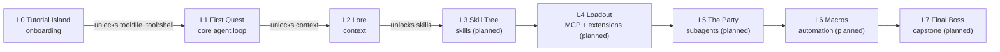

# Curriculum and quest packs

The curriculum is the eight-level arc a learner climbs, and quest packs are the data that define it. Each pack is a directory with a `pack.yml` and quest `.md` files (YAML frontmatter plus a prose body). The pack loader parses and validates them against the Zod schemas, builds a quest graph, and detects cycles. Completing a level's required quests unlocks the next level and its feature gates. Packs are data, not code, so the curriculum grows by adding files rather than touching the engine.

## How it works

### The eight-level arc

The arc uses a gamer-native theme where each themed term travels with its functional word in the UI:

- **L0 Tutorial Island** (onboarding)
- **L1 First Quest** (core agent loop)
- **L2 Lore** (context)
- **L3 Skill Tree** (skills, planned)
- **L4 Loadout** (MCP and extensions, planned)
- **L5 The Party** (subagents, planned)
- **L6 Macros** (automation, planned)
- **L7 Final Boss** (capstone, planned)

L0 through L2 ship in `packs/core/`. L3 through L7 are planned and not yet in `packs/`. See the [glossary](../overview/glossary.md) for the full themed-term list.

### The three shipped packs

| Pack | Path | Level (order) | Quests | Unlocks |
|------|------|---------------|--------|---------|
| Tutorial Island (onboarding) | `packs/core/l0-tutorial-island/` | `tutorial-island` (0) | `install-certified-pi`, `connect-agent`, `second-turn`, `status-screen` (4) | `tool:file`, `tool:shell` |
| First Quest (core agent loop) | `packs/core/l1-first-quest/` | `first-quest` (1) | `first-file`, `first-edit`, `run-command`, `explain-diff`, `revert-change`, `deny-once` (6) | `context` |
| Lore (context) | `packs/core/l2-lore/` | `lore` (2) | `project-lore-file`, `follow-a-rule`, `resume-run`, `context-diet` (4) | `skills` |

### The pack format

A pack directory contains a `pack.yml` and one quest `.md` file per quest. The `pack.yml` carries `PackMetadata`: `id`, `title`, optional `description`, semver `version`, `requires` (adapters and features), and a `levels` array of at least one `Level`. Each level has `id`, `title`, optional `description`, `order`, `quests` (a list of quest IDs), and `unlocks` (feature IDs granted when the level completes).

A quest `.md` file has YAML frontmatter followed by a prose body. The frontmatter fields are:

| Field | Type | Meaning |
|-------|------|---------|
| `id` | `QuestId` | Lowercase slug identifying the quest. |
| `level` | `LevelId` | The level this quest belongs to. |
| `title` | string | Learner-facing title. |
| `xp` | non-negative int | XP awarded on completion. |
| `required` | boolean | Whether this quest counts toward level completion. |
| `prereqs` | `QuestId[]` | Quests that must be completed first (default `[]`). |
| `unlocks` | `FeatureId[]` | Features unlocked when this quest completes (default `[]`). |
| `checks` | `Check[]` | At least one check from the closed DSL. |

The prose body is the learner-facing quest text. For example, `packs/core/l0-tutorial-island/install-certified-pi.md` opens with two checks (an `event` check matching `session_start` and a `json_path` check reading `runtime.certifiedVersion` from `state.json`) and a short paragraph explaining the certified runtime.

### Level completion, XP, and badges

A level completes when every quest marked `required: true` in that level has a `quest_completed` event. `deriveUnlocks` then appends `unlock` events for the level's own `unlocks`, the `unlocks` of every completed quest in the level, and any `UnlockEdge` whose quest is completed, and unlocks the next level in order. XP is the score and feedback layer: each `quest_completed` event carries the quest's `xp`, and the fold sums it into `xpTotal`. XP is not a gate.

Three badges are computed by the progression engine. `completionist` is awarded per level when all quests in the level (not just required ones) are done, and globally when every quest in the graph is done. `no_hint_clear` is awarded when a level's required quests all completed without any `hint_opened` event for that level. `speedrunner` is awarded when the learner used a speedrun or cheat path and still completed all required quests; the `usedSpeedrunPath` flag distinguishes a speedrun completion from a clean one. See [progression](../systems/progression.md) for the computation.

### Speedrun mode

Speedrun is an onboarding choice that unlocks levels ahead without awarding XP. The `garnish init` wizard offers `n`, `all`, or a specific level order. Choosing it appends `unlock` events with reason `speedrun` for the selected levels and their features. The Speedrunner badge stays earnable by later clearing the skipped required quests. See [onboarding](onboarding.md) and the [glossary](../overview/glossary.md).

### Authoring format mirrors the skill format

A quest `.md` file is a YAML-frontmatter-plus-prose Markdown file, the same shape as a skill file. By L3 (Skill Tree) the learner has authored and completed enough quests that the skill format is already internalized. This is an intentional curriculum design choice, not a coincidence.

## Integration points

This feature spans the loader, progression, and the core schema layer:

- [Pack loader](../systems/loader.md): discovers packs, parses frontmatter, validates against Zod, builds the quest graph, detects cycles.
- [Progression](../systems/progression.md): level completion, XP, badges, unlock derivation.
- [Domain model](../primitives/domain-model.md): the `Quest`, `Level`, `Pack`, and `Check` schemas.
- [Glossary](../overview/glossary.md): the themed-term list and curriculum vocabulary.

## Key source files

| File | Purpose |
|------|---------|
| `packs/core/l0-tutorial-island/pack.yml` | L0 pack metadata: level `tutorial-island`, order 0, unlocks `tool:file` and `tool:shell`. |
| `packs/core/l1-first-quest/pack.yml` | L1 pack metadata: level `first-quest`, order 1, unlocks `context`. |
| `packs/core/l2-lore/pack.yml` | L2 pack metadata: level `lore`, order 2, unlocks `skills`. |
| `packs/core/l0-tutorial-island/install-certified-pi.md` | Example L0 quest: event plus json_path checks. |
| `packs/core/l1-first-quest/first-file.md` | Example L1 quest: tool_result event plus file_exists check. |
| `packs/core/l2-lore/project-lore-file.md` | Example L2 quest: file_exists plus command check. |
| `src/loader/index.ts` | `loadPack`, frontmatter parsing, graph assembly, cycle detection. |
| `src/core/pack.ts` | `PackSchema`, `PackMetadataSchema`, `PackRequiresSchema`, `UnlockEdgeSchema`. |
| `src/core/quest.ts` | `QuestSchema`. |
| `src/core/level.ts` | `LevelSchema`. |
