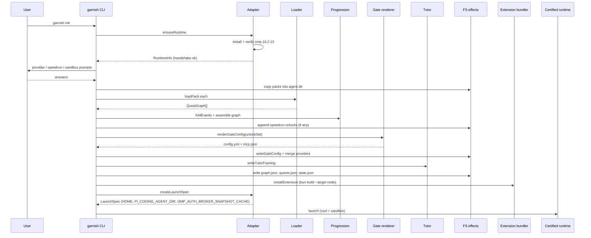

# Onboarding

Onboarding is the `garnish init` flow that takes a learner from an empty shell to a running, gated Pi session with Tutorial Island active. It installs the certified runtime into Garnish-owned storage, asks at most five questions, copies the core packs and assembles the quest graph, renders the locked L0 gate config, writes the tutor framing and pre-serialized state, bundles the extension, and launches the session under an isolation env. The whole path is dependency-injected so the same command core runs under hermetic tests with stubbed effects and recorded fixtures.

## How it works

### 1. ensureRuntime

`initCommand` in `src/cli/init.ts` first calls `ensureRuntime` from `src/adapter/runtime.ts`. This installs the certified omp binary (v16.2.13) into Garnish-owned storage under the Garnish root (`~/.garnish` by default), computes the runtime paths, and runs the version handshake. If the handshake reports anything other than `ok`, init returns early with the doctor message. The learner's global `omp` is ignored; the certified binary is launched by absolute path.

### 2. The wizard

Init asks at most five prompts through an injected `Prompter`:

1. **Provider**: `anthropic`, `openai`, or `other:<ENV_VAR>`. Garnish stores only the env-var reference, never a raw key. The default maps `anthropic` to `ANTHROPIC_API_KEY` and `openai` to `OPENAI_API_KEY`.
2. **Speedrun mode**: `n`, `all`, or a level order. Choosing anything but `n` appends `unlock` events with reason `speedrun` for the selected levels and their features, without awarding XP.
3. **Sandbox directory**: defaults to `<garnish root>/sandbox`. A disposable learning dir, never an existing project by default.

A `QueuedPrompter` supplies the same answers non-interactively for tests, and init throws if it ever exceeds five prompts.

### 3. Pack copying and graph assembly

Init copies each source pack directory into `$PI_CODING_AGENT_DIR/garnish/packs/`, loads each through `loadPack` (which parses frontmatter and validates against the Zod schemas), and assembles a `ProgressionGraph` from the combined levels, quests, and unlock edges. Speedrun unlock events (if any) are appended to `events.jsonl` at this point.

### 4. Gate config render

Init folds the event log (the speedrun unlocks, or an empty log) into a `ProgressionState` and calls `renderGateConfig` with the resulting unlock set. An empty log produces the locked L0 baseline: only the first level is active and only its baseline tools are enabled. `writeGateConfig` writes `config.yml` and `mcp.json` into the agent dir, preserving any non-owned keys.

### 5. Provider key reference merge

Init parses the rendered `config.yml`, merges in a `providers` block mapping the chosen provider name to `{ apiKeyRef: <ENV_VAR> }`, and rewrites the file with the generated header. The raw key never enters the file, only the env-var name.

### 6. Tutor framing write

`writeTutorFraming` from `src/extension/tutor.ts` appends the static tutor framing to `APPEND_SYSTEM.md` in the agent dir. This is an append, never a replace of the defaults, so the agent can answer "what's my quest?" from live quest state. See [tutor bridge](../systems/extension/tutor.md).

### 7. Pre-serialized state writes

Init writes three JSON files into `$PI_CODING_AGENT_DIR/garnish/`:

- `graph.json`: the assembled `ProgressionGraph`.
- `quests.json`: the full quest list.
- `state.json`: a derived snapshot (`activeLevel`, pack IDs, certified runtime version, sandbox dir) consumed by the L0 `install-certified-pi` check and the extension entry.

The bundled extension entry reads these synchronously at session start (readFileSync), because the LOO-118 spike showed extension module init must stay synchronous.

### 8. Extension bundle

The injected `installExtension` callback bundles the extension with `bun build --target node` into `$PI_CODING_AGENT_DIR/extensions/garnish/index.js`, where the certified runtime autoloads it. See [Pi extension](../systems/extension/index.md).

### 9. Launch with isolation

`createLaunchSpec` builds the command that launches the certified binary with an isolation env: `HOME` (Garnish-owned home), `PI_CODING_AGENT_DIR` (the agent dir), and `OMP_AUTH_BROKER_SNAPSHOT_CACHE` (the auth snapshot). The `garnish` shim wraps the launch so the session runs fully isolated from the learner's global Pi state. Init then calls the injected `launch` callback with the spec and the sandbox dir as cwd.

### Hermetic testing

The command core is fully dependency-injected (`RuntimeEffects`, `GateConfigEffects`, `InitFsEffects`, `Prompter`, `installExtension`, `launch`), so tests run init without touching the machine. `GARNISH_OMP_SOURCE` stubs the runtime install source, and recorded event fixtures stand in for live Pi events. The `QueuedPrompter` records asked questions so tests can assert the prompt budget. See [CLI init wizard](../systems/cli/init-wizard.md).

## Key components

| Component | File | Role |
|-----------|------|------|
| Init command | `src/cli/init.ts` | `initCommand` orchestrates the whole flow; `queuedPrompter` for non-interactive tests. |
| Adapter ensureRuntime | `src/adapter/runtime.ts` | Certified runtime install, version handshake, `createLaunchSpec`. |
| Gate renderer | `src/adapter/gates.ts` | `renderGateConfig` and `writeGateConfig` produce the locked L0 baseline. |
| Extension bundler | `src/cli/real.ts` | `bun build --target node` into `extensions/garnish/index.js` (injected as `installExtension`). |
| Launch spec | `src/adapter/runtime.ts` | `createLaunchSpec` builds the isolation env and command. |
| Tutor framing | `src/extension/tutor.ts` | `writeTutorFraming` appends the static framing to `APPEND_SYSTEM.md`. |

## Integration points

This feature spans the CLI, adapter, and extension:

- [CLI init wizard](../systems/cli/init-wizard.md): the init command core and composition root.
- [Pi adapter](../systems/adapter.md): `ensureRuntime`, `renderGateConfig`, `writeGateConfig`, `createLaunchSpec`.
- [Pi extension](../systems/extension/index.md): the bundled extension that autoloads at session start.
- [Tutor bridge](../systems/extension/tutor.md): the static framing written during init.
- [Curriculum](curriculum.md): the packs that init copies and assembles.
- [Capability gating](capability-gating.md): the locked L0 baseline init renders.

## Key source files

| File | Purpose |
|------|---------|
| `src/cli/init.ts` | `initCommand`, `queuedPrompter`, the wizard and graph assembly. |
| `src/adapter/runtime.ts` | `ensureRuntime`, `handshake`, `createLaunchSpec`. |
| `src/adapter/gates.ts` | `renderGateConfig`, `writeGateConfig`. |
| `src/extension/tutor.ts` | `writeTutorFraming`. |
| `src/cli/real.ts` | Composition root binding effects to fs, child_process, and `bun build`. |
