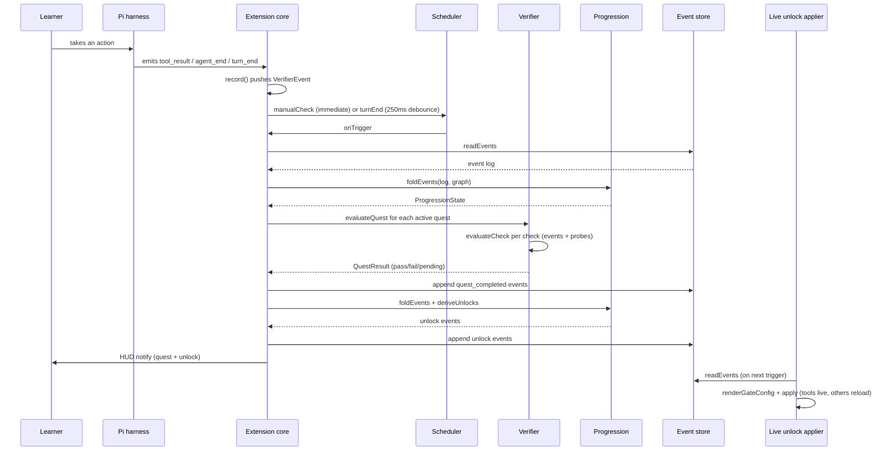

# Quest verification

Quest verification is the loop that turns a learner's real behavior into a confirmed quest completion. The Pi extension observes harness events, the verifier evaluates each active quest's checks against the recorded event stream and on-demand probes, and on a full pass the progression engine appends `quest_completed` and `unlock` events to the log. The whole path is deterministic: v1 has no LLM grading, only the closed check DSL evaluated against observed facts.

## How it works

### 1. The extension observes a Pi event

The extension core in `src/extension/index.ts` subscribes a handler to each name in `PI_EVENTS` (`session_start`, `session_shutdown`, `turn_start`, `turn_end`, `agent_start`, `agent_end`, `tool_call`, `tool_result`, `tool_approval_requested`, `tool_approval_resolved`). Every handler wraps its body in try/catch so a handler error degrades to "quests paused" rather than crashing the session. On `session_start` the extension runs the version handshake and resets the paused state; otherwise it records the event through `record()`, which pushes a normalized `VerifierEvent` (name, seq, optional session ID, payload) onto the in-memory `recorded` array. The `normalizePayload` helper also derives `assistant_turns` from `messages` so `min_assistant_turns` checks work against live events.

### 2. The scheduler triggers

The verifier's scheduler (`createScheduler` in `src/verifier/index.ts`) controls when evaluation fires, and the extension routes each event to the right trigger:

- `turn_end` calls `scheduler.turnEnd()`, debounced by `debounceMs` (default 250ms) so a burst of turn-end events collapses into one evaluation.
- `agent_end` and `tool_result` call `scheduler.manualCheck()`, which cancels any pending debounce and fires immediately. This immediate path is what keeps the 10-second auto-complete contract (PRD AC-2).
- `session_start` calls `scheduler.questActivated()`, which fires immediately so a newly active quest gets an initial evaluation.

Each trigger calls `onTrigger`, which the extension routes to `scheduleEvaluation()`. Evaluations are serialized on a single `evaluating` promise chain so they never overlap.

### 3. evaluateActiveQuests runs

`evaluateActiveQuests` reads the durable event log from the store, folds it with `foldEvents` to get the current `ProgressionState`, and computes the active quests: not yet completed, in an unlocked level, with all prereqs met. For each active quest it calls `evaluateQuest` with an `EvaluationContext` carrying the probes, the in-memory `recorded` events, the current session ID, and path templates like `{agent_dir}` and `{sandbox}`.

### 4. Checks evaluate against events and probes

`evaluateQuest` loops the quest's checks and calls `evaluateCheck` on each, dispatching by `check.type`. Event checks scan the recorded stream from an optional `after` boundary, optionally constrained to the same session; the other eight types run on-demand probes (`fileExists`, `readFile`, `runCommand`, `mcpHandshake`, `skillValid`, `confirm`). A single `fail` fails the quest; otherwise a `pending` (only `confirm` can return pending) leaves the quest pending; all `pass` passes the quest. There is no LLM in this path, only the nine check types in the closed DSL.

### 5. On all-pass, the extension appends completions and derives unlocks

For every quest that passes, the extension builds a `quest_completed` event (carrying `quest_id`, `level_id`, `required`, and `xp`) and appends the batch to the store. It then re-folds the log with the new completions and calls `deriveUnlocks` to compute the `unlock` events that follow from any newly completed levels, appending those too. State is durable the moment these events land in `events.jsonl`.

### 6. HUD notifies and the gate applier runs

The extension notifies the UI for each completion (`Quest complete: <id> (+<xp> XP)`) and each unlock (`Unlocked: feature <id>` or `Unlocked: level <id>`). The live unlock module in `src/extension/unlocks.ts` is separately subscribed to `session_start`, `turn_end`, and `agent_end`; on the next trigger it folds the store, renders the gate config, diffs the enabled capabilities against what it has already applied, and applies the fresh ones. Tool capabilities apply live via `setActiveTools` without a reload; config-baked surfaces (providers, skills, MCP, extensions, approval mode) are written to `config.yml` and `mcp.json` and applied with `session.reload()`. See [live unlocks](../systems/extension/unlocks.md) and [capability gating](capability-gating.md).

## Key components

| Component | File | Role in the flow |
|-----------|------|------------------|
| Extension core | `src/extension/index.ts` | Subscribes to Pi events, records them, routes to the scheduler, runs `evaluateActiveQuests`, appends completions and unlocks, notifies the HUD. |
| Verifier | `src/verifier/index.ts` | `evaluateQuest` and `evaluateCheck` dispatch the check DSL; `createScheduler` debounces and triggers evaluation. |
| Progression | `src/progression/index.ts` | `foldEvents` rebuilds state from the log; `deriveUnlocks` computes the unlock events that follow level completions. |
| Live unlock applier | `src/extension/unlocks.ts` | Folds the store, renders the gate config, and applies fresh capabilities (tools live, config-baked surfaces with a reload). |
| HUD | `src/extension/hud.ts` | Renders the status line and `/quest` command surface that surface quest state and completion to the learner. |

## Integration points

This feature spans three systems plus the core schema layer:

- [Extension](../systems/extension/index.md): the event wiring and evaluation loop that drives the whole flow.
- [Verifier](../systems/verifier.md): the check evaluators and scheduler.
- [Progression](../systems/progression.md): the fold and unlock derivation.
- [Domain model](../primitives/domain-model.md): the `Check` discriminated union and `EventMatch` schema the verifier consumes.
- [Progression events](../primitives/progression-events.md): the `quest_completed` and `unlock` event types the extension appends.

## Key source files

| File | Purpose |
|------|---------|
| `src/extension/index.ts` | Event subscription, recording, `evaluateActiveQuests`, completion and unlock append, HUD notify. |
| `src/verifier/index.ts` | `evaluateQuest`, `evaluateCheck`, per-type evaluators, `createScheduler`. |
| `src/progression/index.ts` | `foldEvents`, `deriveUnlocks`. |
| `src/extension/unlocks.ts` | Live unlock application (tools vs config-baked surfaces). |
| `src/core/checks.ts` | The `Check` discriminated union and `EventMatch` schema (see [domain model](../primitives/domain-model.md)). |
| `src/core/progression.ts` | The `ProgressionEvent` union (see [progression events](../primitives/progression-events.md)). |
