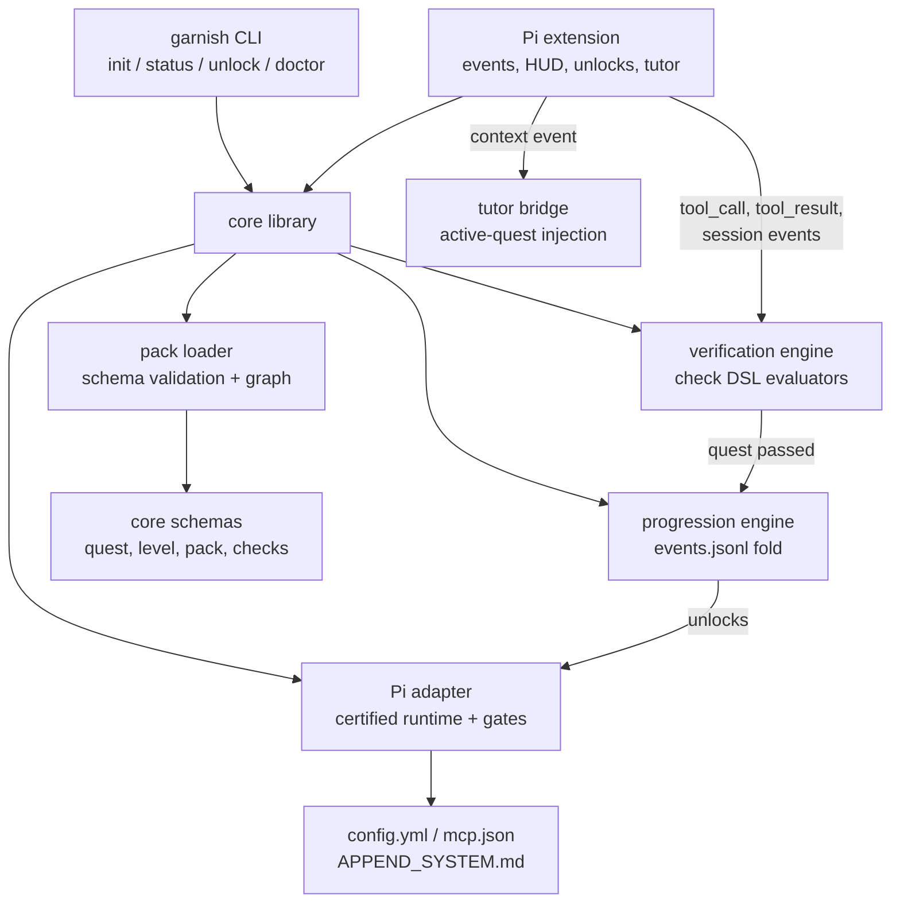
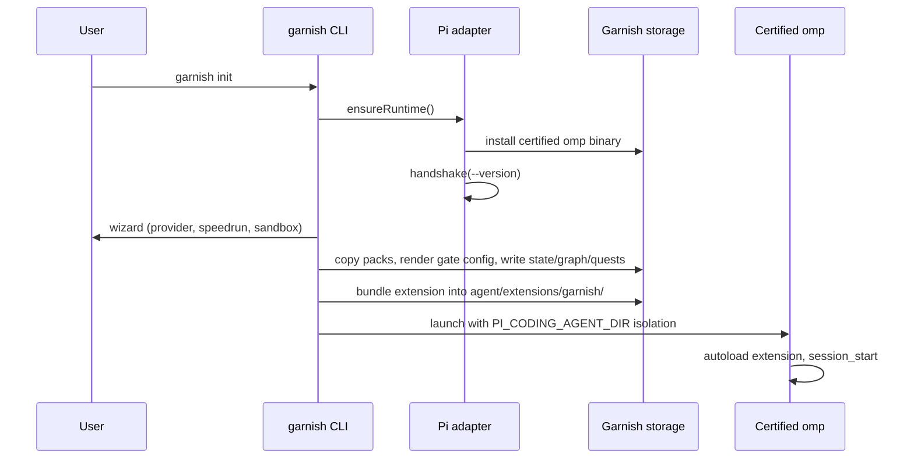
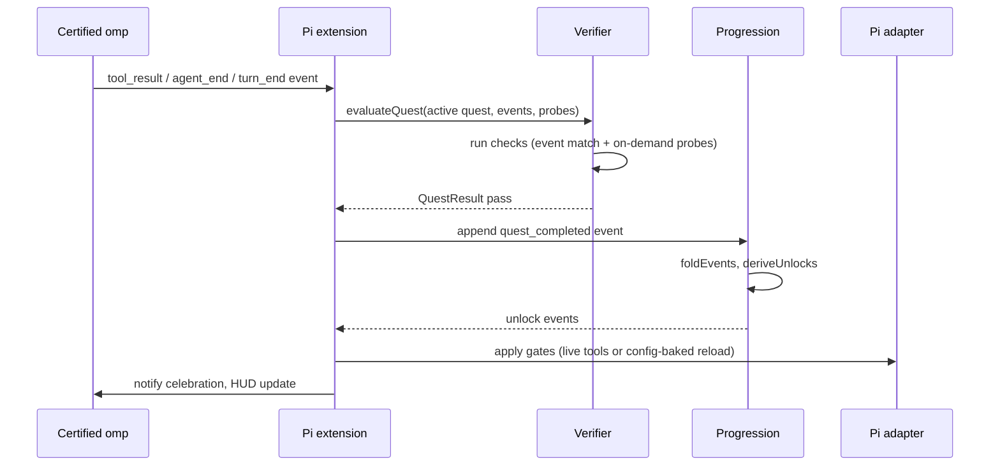

# Architecture

Garnish is a single TypeScript package with three entry points that share one core library. Two of those entry points are deployable artifacts: a CLI (`src/cli.ts`) and a Pi extension (`src/extension.ts`). The third (`src/index.ts`) re-exports the core library for programmatic use. A versioned `HarnessAdapter` seam isolates all Pi-specific knowledge so the curriculum, progression, and verification logic stays harness-agnostic.

## Component model



The diagram mirrors the one in `docs/ard.md`. Each box maps to a source directory under `src/`.

## Two artifacts, one core

The CLI and extension never duplicate logic. Both compose the same core modules:

- **CLI** (`src/cli/`) handles everything outside a session: the onboarding wizard (`garnish init`), status rendering, the unlock escape hatch, and the doctor diagnostic. `src/cli/real.ts` is the composition root that binds command cores to the filesystem, child processes, and the bundled extension. The command cores in `src/cli/index.ts` take dependency-injected `CliDeps`, so they run as fast unit tests against fakes.

- **Pi extension** (`src/extension/`) handles everything inside a session: subscribes to live Pi events, feeds the verification engine, renders the HUD (widget, status line, completion toasts), registers slash commands (`/quest`, `/unlock`), injects tutor context, and applies unlocks live or via session reload. `src/extension/entry.ts` is the real composition root that `garnish init` bundles with `bun build --target node` into the agent dir for Pi to autoload.

## Key data flows

### Onboarding



The full flow lives in `src/cli/init.ts`. The wizard is capped at five prompts (provider, speedrun offer, sandbox directory). Provider keys land as env-var references only; raw keys are never persisted.

### Quest completion



Verification is debounced on `turn_end` (250ms default) with an immediate path on `agent_end` and `tool_result` to keep the 10-second auto-complete contract. Quests complete only when all checks pass; the progression engine appends a `quest_completed` event, then derives and appends `unlock` events.

## Isolation model

Garnish never touches the learner's real harness config. All state lives under a Garnish-owned storage root (default `~/.garnish`, overridable via `GARNISH_ROOT`):

```
~/.garnish/
  runtime/pi/omp-16.2.13/bin/omp     certified binary copy
  agent/                              PI_CODING_AGENT_DIR target
    config.yml                        generated gate config
    mcp.json                          generated MCP gate config
    APPEND_SYSTEM.md                  static tutor framing
    extensions/garnish/index.js       bundled extension
    garnish/
      events.jsonl                    append-only event log (source of truth)
      state.json                      derived snapshot
      graph.json                      progression graph
      quests.json                     full quest definitions
      packs/                          copied quest packs
  home/                               isolated HOME for launched sessions
  auth/omp-auth-broker-snapshot.enc   auth broker snapshot cache
  bin/garnish                         CLI shim for in-session use
```

`src/adapter/runtime.ts` computes these paths and asserts none escape the Garnish root. The launch spec in `createLaunchSpec` sets `HOME`, `PI_CODING_AGENT_DIR`, and `OMP_AUTH_BROKER_SNAPSHOT_CACHE` so the certified binary runs fully isolated.

## Language breakdown

The codebase is TypeScript throughout, with YAML and JSON data files for packs and fixtures. The test suite is nearly as large as the source (see [by the numbers](../by-the-numbers.md)), reflecting the emphasis on deterministic, fixture-driven verification.

For how the pieces fit together at the code level, see [systems](../systems/index.md), [features](../features/index.md), and [primitives](../primitives/index.md). For the decisions behind this architecture, see [design decisions](../background/design-decisions.md).
