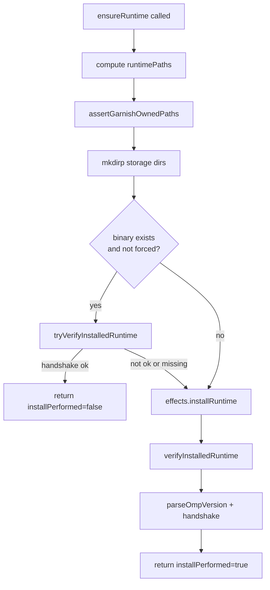

# Pi adapter

The adapter is the only module in the codebase that knows Pi specifics. It owns the certified runtime install and version handshake, renders the gate config that physically enables and disables Pi surfaces, and asserts the adapter contract that pins the event names and isolation facts Garnish depends on. Everything above it, the curriculum, progression, and verification logic, stays harness-agnostic.

## Directory layout

```
src/adapter/
  types.ts       interfaces and branded version types
  runtime.ts     certified runtime paths, ensureRuntime, handshake, launch spec
  gates.ts       v1GateCatalog, renderGateConfig, writeGateConfig, parity checks
  contract.ts    adapter contract object and assertAdapterContract
  index.ts       re-exports
```

## Key abstractions

| Type | File | Description |
|------|------|-------------|
| `HarnessAdapter` | `src/adapter/types.ts` | The versioned seam: id, certified version, release, `runtimePaths`, `ensureRuntime`, `launch`, `handshake`. |
| `CertifiedRuntimeRelease` | `src/adapter/types.ts` | Pinned release record: harness `pi`, binary `omp`, version `16.2.13`, verified date, evidence issue `LOO-118`. |
| `RuntimePaths` | `src/adapter/types.ts` | All Garnish-owned storage paths (runtime, bin, agent, home, auth snapshot) derived from a Garnish root. |
| `RuntimeEffects` | `src/adapter/types.ts` | Dependency-injected side effects: `exists`, `mkdirp`, `installRuntime`, `execFile`. |
| `RuntimeInfo` | `src/adapter/types.ts` | Result of `ensureRuntime`: paths, parsed version, handshake outcome, whether install ran. |
| `VersionHandshake` | `src/adapter/types.ts` | Discriminated union: `ok` when the reported version matches certified, `paused` with doctor hints otherwise. |
| `GateCatalog` | `src/adapter/gates.ts` | Map of feature ID to the Pi config surfaces (`tool`, `skill`, `mcpServer`, `extension`, `provider`, `approvalMode`) that implement it. |
| `RenderedGateConfig` | `src/adapter/gates.ts` | The rendered `config.yml` and `mcp.json` payloads plus their stable serialized text. |
| `GateConfigEffects` | `src/adapter/gates.ts` | Dependency-injected file effects for `writeGateConfig`; an optional `readFile` enables non-owned key preservation. |
| `AdapterContract` | `src/adapter/contract.ts` | Pinned facts about the Pi surface Garnish relies on: event names, approval denial shape, isolation boundaries. |

## How it works

### Certified runtime

`runtimePaths` computes every path under the Garnish root (`~/.garnish` by default). The runtime lives at `runtime/pi/omp-16.2.13/bin/omp`, the agent dir at `agent/`, the isolated home at `home/`, and the auth broker snapshot at `auth/omp-auth-broker-snapshot.enc`. `assertGarnishOwnedPaths` verifies none of these escape the root.

`ensureRuntime` is idempotent. It creates the storage dirs, then if the binary already exists and is not forced, it tries to verify the installed runtime first. If verification reports the certified version it returns early with `installPerformed: false`. Otherwise it calls `installRuntime` and verifies again, returning `installPerformed: true`. Verification runs the binary with `--version`, parses the output with `parseOmpVersion`, and feeds the result to `handshake`.

`handshake` normalizes the reported version (parsing `omp/16.2.13` lines, exact version strings, or trimmed text) and compares it to `certifiedVersion`. On mismatch it returns a `paused` status with a doctor message instructing the learner to re-run `garnish init` or `garnish doctor`.

`createLaunchSpec` builds the command that launches the certified binary by absolute path, setting `HOME`, `OMP_AUTH_BROKER_SNAPSHOT_CACHE`, and `PI_CODING_AGENT_DIR` so the session runs fully isolated.



### Gate config rendering

`renderGateConfig` takes a `ProgressionUnlockSet` and a catalog (default `v1GateCatalog`) and produces the `config.yml` and `mcp.json` that physically enable or disable Pi surfaces. It walks the catalog, builds the set of unlocked capabilities, then writes tool enabled flags, skill globs, disabled providers and extensions, MCP enablement, and approval mode. Serialization is stable: keys are sorted alphabetically and the YAML/JSON is regenerated deterministically on every render. A `# Generated by Garnish` header marks the file as owned.

`writeGateConfig` writes the rendered files into the agent dir. If the effects provide a `readFile`, it merges by preserving non-owned top-level keys (such as a learner's `providers` block with `apiKeyRef`) while replacing Garnish-owned arrays wholesale. `stockParityConfig` renders the fully-unlocked baseline used for parity checks, and `findGateMonotonicityViolations` verifies across a sequence of renders that capabilities are only ever added, never removed.

The `v1GateCatalog` maps feature IDs to surfaces: `context` (providers), `extensions`, `mcp`, `skills`, `subagents` (the `task` tool), `tool:bash`, `tool:file` (edit, glob, grep, read, write), and `tool:shell`. The `native` provider is deliberately not gated, because disabling it would also disable the extension autoload that Garnish's own extension depends on.

### Adapter contract

`adapterContract` is a const object that pins the facts Garnish relies on: the binary is `omp`, the certified version, the `--version` command shape, the seven event names (`session_start`, `context`, `tool_call`, `tool_result`, `agent_end`, `tool_approval_requested`, `tool_approval_resolved`), the approval-denial shape (observed via `tool_approval_resolved` with `approved: false`, no separate `approval_denied` event), and the isolation facts (`PI_CODING_AGENT_DIR` isolates sessions, config, and auth stores but not `~/.omp/logs`). `assertAdapterContract` validates the object against these invariants and is called from tests to fail fast if a refactor drifts from the certified Pi surface.

## Integration points

- **Imports from:** `src/core` (FeatureId), `src/progression` (ProgressionUnlockSet), `yaml` for config parsing and serialization, `node:path`.
- **Imported by:** `src/cli/real.ts` (composition root binds runtime and gate effects to fs and child_process), `src/cli/init.ts` (calls `ensureRuntime`, `renderGateConfig`, `writeGateConfig`, `createLaunchSpec` during onboarding), `src/extension/entry.ts` (real composition root), `src/extension/unlocks.ts` (renders and writes gate config when unlocks apply live).
- **Tested by:** `tests/adapter/` (runtime, gates, contract suites).

## Entry points for modification

To add a new gate surface, add an entry to `v1GateCatalog` in `src/adapter/gates.ts` mapping a feature ID to the new `GateSurface`, and add the matching renderer behavior in `renderGateConfig` if the surface kind is new. To support a new certified Pi version, update `certifiedVersion` and `certifiedRelease` in `src/adapter/runtime.ts`, adjust the event names or isolation facts in `src/adapter/contract.ts` if the Pi surface changed, and update the adapter contract tests in `tests/adapter/`. See [capability gating](../features/capability-gating.md) for the feature-level view and [domain model](../primitives/domain-model.md) for the schema primitives.

## Key source files

| File | Purpose |
|------|---------|
| `src/adapter/runtime.ts` | Certified version, runtime paths, `ensureRuntime`, `handshake`, `createLaunchSpec`. |
| `src/adapter/gates.ts` | `v1GateCatalog`, `renderGateConfig`, `writeGateConfig`, parity and monotonicity checks. |
| `src/adapter/contract.ts` | `adapterContract` object and `assertAdapterContract`. |
| `src/adapter/types.ts` | All adapter interfaces and branded version types. |
| `src/adapter/index.ts` | Public re-exports for the adapter module. |
