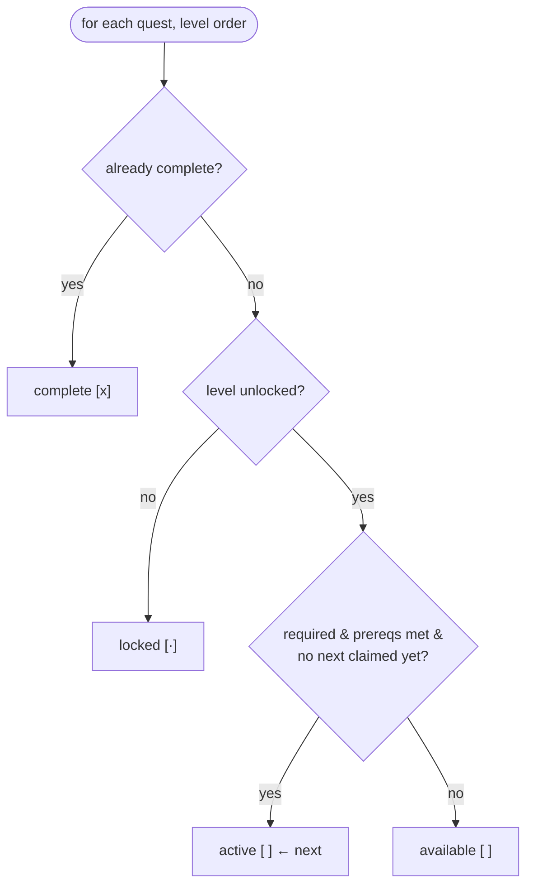

# CLI commands

The `status`, `quest`, `unlock` (alias `cheat`), and `doctor` command cores live in `src/cli/index.ts`. Each is a dependency-injected function that takes a `CliDeps` or `DoctorDeps` slice and returns a `CommandOutcome`. The `main` dispatcher maps `argv` to a handler; everything is pure relative to the injected store and effects, so the cores run as fast unit tests against fakes.

## Directory layout

```
src/cli/
  index.ts    statusCommand, questCommand, unlockCommand, doctorCommand, main, usage
  real.ts     builds CliDeps/DoctorDeps from loadInstalledState + runtimePaths
  state.ts    ProgressionStore backing the cores (createFsEventStore)
```

## Key abstractions

| Abstraction | Where | Role |
| --- | --- | --- |
| `CliDeps` | `src/cli/index.ts` | Dependency slice: `graph`, `quests`, `store`, `now`, `catalog`, `runtimePaths`, `gateEffects`. |
| `DoctorDeps` | `src/cli/index.ts` | Dependency slice: `runtimeInstalled`, `reportedVersion`, `isolatedConfigPresent`. |
| `CommandOutcome` | `src/cli/index.ts` | `{ text, exitCode }` returned by every command. |
| `ProgressionStore` | `src/cli/index.ts` | `readEvents`/`appendEvents`; the only mutation surface. |
| `UnlockOptions` | `src/cli/index.ts` | `{ all?, level? }` parsed by `parseUnlockArgs`. |
| `QuestLine` | `src/cli/index.ts` | `{ quest, state, isNext }` row used by `renderStatus`. |
| `MainDeps` | `src/cli/index.ts` | `{ cli: CliDeps, doctor: DoctorDeps }` passed to `main`. |

## How it works

`main(argv, deps)` switches on `argv[0]` to `statusCommand`, `questCommand`, `unlockCommand`/`cheatCommand`, or `doctorCommand`, and falls back to `usage()` with exit code 2. `parseUnlockArgs` walks the rest of `argv` for `--all` and `--level <id|N>`.

`renderStatus` folds the event log into a `ProgressionState` and prints the current level label (`Level <order> — <id>` or `all levels complete`), total XP, badges (with their level when scoped), and a per-level quest list. Each quest gets a marker: `[x]` for complete, `[·]` for locked, `[ ]` otherwise, plus a `← next` suffix on the active quest and `(optional)` on non-required quests. A trailing `Next:` line points at the active quest or reports that all required quests are done.

`questCommand` finds the next quest and prints its full text: title, XP, description, and a per-check summary produced by `describeCheck` (e.g. `event connect-agent`, `file exists: {sandbox}/README.md`, `command: bun install`). When the full quest definitions are not supplied it prints the graph-level metadata with a note that full text is unavailable.

`unlockCommand` is the escape hatch. With `--all` it unlocks every feature in the catalog and every level; with `--level <id|N>` it unlocks one level and its features. It appends `unlock` events with `reason: "cheat"` (no XP), re-folds, and re-renders the gate config with `renderGateConfig` + `writeGateConfig` when `runtimePaths` and `gateEffects` are present. The success note reminds the learner that skipped quests award no XP and that clearing them later earns the Speedrunner badge.

`doctorCommand` checks three things: the certified runtime is installed (`existsSync(binaryPath)`), the version handshake is ok (`handshake(reportedVersion())`), and the isolated Garnish config is present (`config.yml` under the agent dir). Each failed check lowers the exit code to 1 and appends a `→` guidance line pointing at `garnish init` or `garnish unlock --level 0`.

The quest display state comes from `computeQuestLines`. For each level in order, a level is unlocked if it is the first level, already in `unlockSet.levels`, or in `completedLevels`. Each quest is `complete` if in `completedQuests`, `locked` if its level is not unlocked, `active` if it is required, its prereqs are all complete, and no earlier quest claimed the `next` slot, otherwise `available`.



## Integration points

- **Progression** (`src/progression/`): `foldEvents` produces the `ProgressionState` every render reads.
- **Adapter** (`src/adapter/`): `renderGateConfig`, `writeGateConfig`, `catalogFeatureIds`, `v1GateCatalog`, and `handshake` back `unlock` and `doctor`.
- **Core** (`src/core/`): `Quest`, `FeatureId`, `LevelId`, `ProgressionEvent`, `UnlockEvent` types flow through every command.
- **State** (`src/cli/state.ts`): `createFsEventStore` is the real `ProgressionStore`; `loadInstalledState` supplies the graph and quests.

## Entry points for modification

To add a command, add a `case` to `main()` and a handler function that takes a `CliDeps` (or a new deps slice), then add a line to `usage()` and teach `src/cli/real.ts`'s `runGarnish` to accept the verb. To change status rendering, edit `renderStatus` or `computeQuestLines`; to change the unlock semantics (XP, reasons, what gets re-rendered), edit `unlockCommand`.

## Key source files

| File | Role |
| --- | --- |
| `src/cli/index.ts` | Command cores, `main`, `usage`, `parseUnlockArgs`, `computeQuestLines`. |
| `src/cli/real.ts` | Builds the real `CliDeps`/`DoctorDeps` passed to `main`. |
| `src/cli/state.ts` | `ProgressionStore` interface and fs-backed implementation. |

See [CLI](index.md) for the dispatch from `runGarnish`, [systems/progression](../progression.md) for the event fold that produces the state these commands render, and [features/capability-gating](../../features/capability-gating.md) for how `unlock`'s gate config rewrite surfaces as new harness features.
