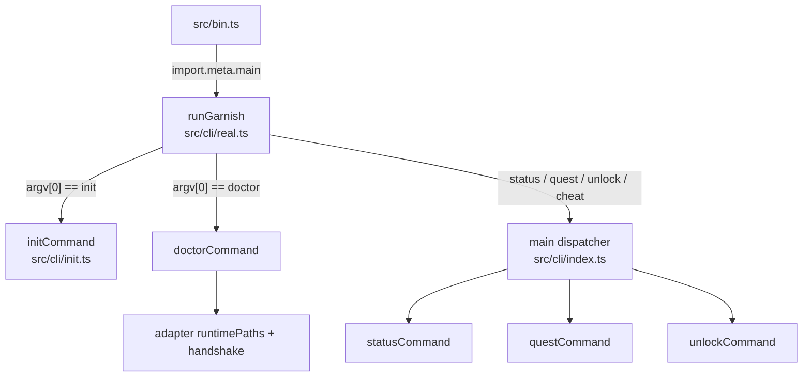

# CLI

The `garnish` CLI handles everything outside a session: onboarding (`garnish init`), status, the unlock escape hatch, and the doctor diagnostic. It is split into dependency-injected command cores that run as fast unit tests, and a single composition root that binds those cores to the filesystem, child processes, `Bun.build`, and stdin. The durable state the CLI reads and writes lives under the Garnish-owned agent dir as pre-serialized JSON plus an append-only event log.

## Directory layout

```
src/cli/
  index.ts    command cores (status/quest/unlock/doctor) + main dispatcher
  real.ts     composition root: runGarnish binds cores to the machine
  init.ts     onboarding wizard (garnish init)
  state.ts    loadInstalledState + createFsEventStore
src/bin.ts    executable entrypoint (bun src/bin.ts or the {root}/bin/garnish shim)
```

## Key abstractions

| Abstraction | Where | Role |
| --- | --- | --- |
| `runGarnish` | `src/cli/real.ts` | Composition root. Parses `argv`, resolves the Garnish root, and dispatches to `init`, `doctor`, or `main`. |
| `CliDeps` | `src/cli/index.ts` | Dependency slice for `status`/`quest`/`unlock`: `graph`, `quests`, `store`, `now`, `catalog`, `runtimePaths`, `gateEffects`. |
| `ProgressionStore` | `src/cli/index.ts` | `readEvents`/`appendEvents` interface; synchronous or async. Backed by `events.jsonl` in real runs. |
| `DoctorDeps` | `src/cli/index.ts` | Dependency slice for `doctor`: `runtimeInstalled`, `reportedVersion`, `isolatedConfigPresent`. |
| `CommandOutcome` | `src/cli/index.ts` | `{ text, exitCode }` returned by every command core. |
| `loadInstalledState` | `src/cli/state.ts` | Reads `graph.json`, `quests.json`, `state.json` from `{agent_dir}/garnish/` and returns the parsed graph, quests, and events path. |
| `createFsEventStore` | `src/cli/state.ts` | Synchronous fs-backed `ProgressionStore` over `events.jsonl`. |

## How it works

`src/bin.ts` is the executable entrypoint. When run as the main module it calls `runGarnish(process.argv.slice(2))`, prints `outcome.text`, and exits with `outcome.exitCode`. `runGarnish` in `src/cli/real.ts` resolves the Garnish root (`$GARNISH_ROOT`, else `~/.garnish`) and the repo root, then branches on `argv[0]`:

- `init` delegates to `runInit`, which builds real effects and calls `initCommand` (see [init wizard](init-wizard.md)).
- `doctor` builds `DoctorDeps` from `runtimePaths` and calls `doctorCommand`.
- `status`, `quest`, `unlock`, `cheat` load installed state via `loadInstalledState`, build a `CliDeps` with `createFsEventStore`, and hand `argv` to `main` (see [CLI commands](commands.md)).
- Anything else prints `usage()` with exit code 2.



The two-layer split keeps the command cores pure. `src/cli/index.ts` imports only `adapter`, `core`, `progression`, and `verifier` types, so `statusCommand`, `questCommand`, `unlockCommand`, `doctorCommand`, and `main` run against fakes in unit tests. `src/cli/real.ts` is the only file that touches `node:fs`, `node:child_process`, `node:readline`, and `Bun.build`.

The durable state layer in `src/cli/state.ts` is synchronous on purpose. `loadInstalledState` reads `graph.json`, `quests.json`, and `state.json` with `readFileSync` and validates each against a Zod schema (`GraphFileSchema`, `QuestSchema`, `StateFileSchema`). `createFsEventStore` returns a store whose `readEvents` splits `events.jsonl` into lines and parses each with `ProgressionEventSchema`, and whose `appendEvents` mkdirs the parent and appends one JSON object per line. The same store backs both the CLI and the bundled extension, so `garnish status` and the in-session HUD read the same source of truth.

On a successful `init`, `src/cli/real.ts` also writes a `bin/garnish` shim into the Garnish root so `garnish …` works inside the learner's session (where the extension's command probe resolves `{root}/bin/garnish`) and from any shell without PATH games.

## Integration points

- **Adapter** (`src/adapter/`): `runtimePaths` computes the agent dir; `handshake` backs `doctor`; `renderGateConfig` and `writeGateConfig` back `unlock`'s config regeneration; `ensureRuntime` and `createLaunchSpec` back `init`.
- **Loader** (`src/loader/`): `loadPack` validates each copied pack in `init`.
- **Progression** (`src/progression/`): `foldEvents` turns `events.jsonl` into the state every command renders.
- **Extension** (`src/extension/`): `bundleExtension` in `src/cli/real.ts` runs `Bun.build` on `src/extension/entry.ts` and writes the bundle into the agent dir during `init`.

## Entry points for modification

To add a CLI command, add a `case` to `main()` in `src/cli/index.ts` plus a handler function that takes a `CliDeps` slice, then teach `runGarnish` in `src/cli/real.ts` to recognize the new verb. To change how commands bind to the machine (fs, child processes, stdin, bundling), edit `src/cli/real.ts`, the only composition root. The durable file format lives in `src/cli/state.ts`; change the schemas there and `init`'s writes must follow.

## Key source files

| File | Role |
| --- | --- |
| `src/bin.ts` | Executable entrypoint; calls `runGarnish` and exits with the outcome. |
| `src/cli/real.ts` | Composition root; `runGarnish`, real effects, extension bundling, shim write. |
| `src/cli/index.ts` | Command cores, `main` dispatcher, `usage`. |
| `src/cli/init.ts` | Onboarding wizard; see [init wizard](init-wizard.md). |
| `src/cli/state.ts` | `loadInstalledState`, `createFsEventStore`, file schemas. |

See [init wizard](init-wizard.md) for the onboarding flow and [CLI commands](commands.md) for the status/quest/unlock/doctor cores. The adapter the CLI composes is documented in [systems/adapter](../adapter.md), and the progression engine that produces the state it renders is in [systems/progression](../progression.md).
