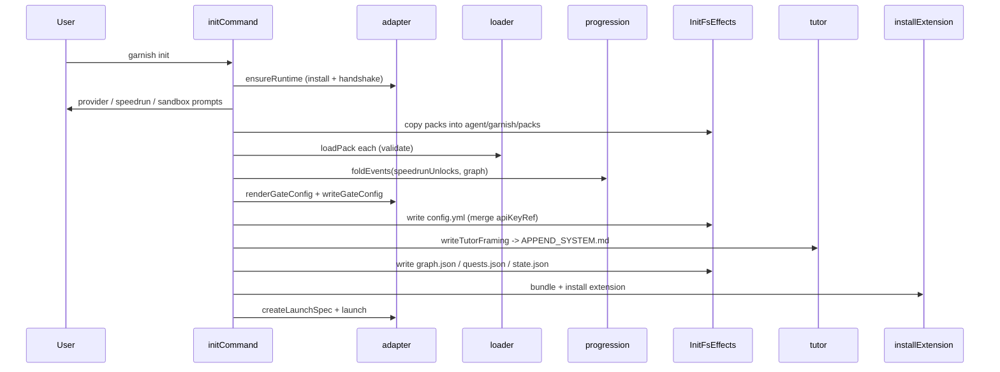

# Init wizard

The `garnish init` onboarding flow in `src/cli/init.ts` provisions a Garnish-owned agent dir from scratch: installs the certified Pi runtime, runs a short wizard, copies and validates the core packs, renders the gated config, writes pre-serialized state, bundles the extension, and launches the certified binary in an isolated sandbox. It is capped at five prompts so onboarding stays fast, and it is fully drivable from a queued prompter for non-interactive tests.

## Directory layout

```
src/cli/
  init.ts    initCommand, Prompter, QueuedPrompter, InitDeps, InitResult
  real.ts    runInit builds real effects + StdinPrompter, calls initCommand
```

## Key abstractions

| Abstraction | Where | Role |
| --- | --- | --- |
| `InitDeps` | `src/cli/init.ts` | Full dependency slice: `garnishRootDir`, `packSourceDirs`, `prompter`, `runtimeEffects`, `gateEffects`, `fs`, `installExtension`, `launch`, `now`, `catalog`. |
| `InitFsEffects` | `src/cli/init.ts` | fs interface: `mkdirp`, `writeFile`, `copyDir`, `appendFile`. Real binding in `src/cli/real.ts`'s `realInitFs`. |
| `Prompter` | `src/cli/init.ts` | `ask(question, defaultAnswer)` interface; returns a string or promise of one. |
| `QueuedPrompter` | `src/cli/init.ts` | Non-interactive `Prompter` backed by a fixed answer queue; records every question asked. |
| `InitResult` | `src/cli/init.ts` | Extends `CommandOutcome` with `promptCount`, `runtime`, `providerEnvVar`, `speedrunUnlocks`, `sandboxDir`, `launchSpec`. |

## How it works

`initCommand` wraps the injected `Prompter` in an `ask` helper that increments a counter and throws if it exceeds five. The four wizard steps are:

1. **`ensureRuntime`** (no prompt). Installs the certified Pi binary into Garnish-owned storage and runs the version handshake. If the handshake fails, `initCommand` returns early with the doctor guidance and a non-zero exit code.
2. **Provider** (`anthropic` / `openai` / `other:<ENV_VAR>`). Resolves to an env-var name (`ANTHROPIC_API_KEY`, `OPENAI_API_KEY`, or the suffix of `other:`). Raw keys are never persisted; only the `apiKeyRef` lands in `config.yml`.
3. **Speedrun** (`n` / `all` / `<level order>`). When not `n`, generates `unlock` events with `reason: "speedrun"` for the chosen levels and their features. These award no XP and mark `usedSpeedrunPath`, which keeps the Speedrunner badge earnable on later cleanup.
4. **Sandbox** (default `<garnish root>/sandbox`). A disposable learning dir, never an existing project by default.

After the prompts, `initCommand` copies each source pack into `{agent_dir}/garnish/packs`, validates it with `loadPack`, and assembles a single `ProgressionGraph` from the per-pack `QuestGraph` results. Speedrun unlock events (if any) are appended to `events.jsonl`. It then folds the log, renders the gate config with `renderGateConfig`, writes it with `writeGateConfig`, and writes the Garnish-owned `config.yml` by parsing the rendered YAML and merging in `providers: { <name>: { apiKeyRef: <env> } }` under a generated header. `writeTutorFraming` appends the static tutor identity to `APPEND_SYSTEM.md`.

The remaining writes are pre-serialized JSON the bundled extension reads synchronously at session start: `graph.json` (the assembled `ProgressionGraph`), `quests.json` (the full quest definitions), and `state.json` (a derived snapshot with `activeLevel`, `packs`, `runtime.certifiedVersion`, and `sandboxDir`, consumed by the L0 `install-certified-pi` check and `src/extension/entry.ts`). `installExtension` bundles the extension into `{agent_dir}/extensions/garnish/index.js`. Finally `initCommand` mkdirs the sandbox, builds a `LaunchSpec` with `createLaunchSpec`, and calls `launch`.



The `Prompter` interface is just `ask(question, defaultAnswer?)`. `queuedPrompter(answers)` returns a `QueuedPrompter` that pops the next answer (or the default) for each question and records the questions in `askedQuestions`, so tests assert both the answers given and the prompts shown. `src/cli/real.ts`'s `createStdinPrompter` branches on `process.stdin.isTTY`: TTY mode uses `node:readline/promises`; piped mode reads all of stdin up front (readline drops lines buffered before `question()` attaches). The piped prompter closes the readline before launch so the child TUI inherits stdin cleanly, a fix from the LOO-139 walkthrough where the omp setup wizard froze mid-flow.

## Integration points

- **Adapter** (`src/adapter/`): `ensureRuntime` (runtime install + handshake), `renderGateConfig` and `writeGateConfig` (gate config), `createLaunchSpec` (isolated launch env).
- **Loader** (`src/loader/`): `loadPack` validates each copied pack and returns a `QuestGraph`.
- **Progression** (`src/progression/`): `foldEvents` folds the speedrun unlock events into the state used to render the initial gate config.
- **Tutor** (`src/extension/tutor.ts`): `writeTutorFraming` writes the static identity framing to `APPEND_SYSTEM.md`; see [tutor bridge](../extension/tutor.md).
- **Extension** (`src/extension/entry.ts`): `installExtension` in `src/cli/real.ts` bundles the entry with `Bun.build --target node`.

## Entry points for modification

To add a wizard prompt, add an `ask(...)` call inside `initCommand` and mind the five-prompt cap (the `ask` helper throws past it). To change provisioning (which files get written, what the config merge looks like, how the snapshot is shaped), edit the file writes in `initCommand`; the schemas in `src/cli/state.ts` must agree. To change the real effects (fs, runtime install, bundling, launch), edit `src/cli/real.ts`'s `runInit` and its effect factories.

## Key source files

| File | Role |
| --- | --- |
| `src/cli/init.ts` | `initCommand`, `Prompter`, `queuedPrompter`, `InitDeps`, `InitResult`. |
| `src/cli/real.ts` | `runInit`, `realInitFs`, `realRuntimeEffects`, `realGateEffects`, `createStdinPrompter`, `bundleExtension`. |

See [CLI](index.md) for where `init` sits in the dispatch, [features/onboarding](../../features/onboarding.md) for the learner-facing onboarding experience, and [systems/adapter](../adapter.md) for the runtime, gate, and launch seams the wizard composes.
