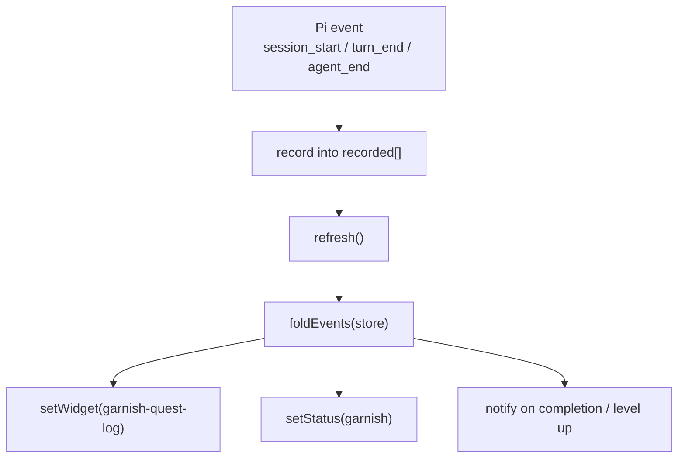

# HUD

The HUD renders Garnish inside the learner's session: a widget above the editor with the level, XP, and active quest, a compact status line, completion toasts, and a `/quest` slash command. It lives in `src/extension/hud.ts` and is wired onto the same `pi` as the core extension by `src/extension/entry.ts`. The HUD is best-effort: headless or no-UI runs degrade safely and verification is unaffected.

## Directory layout

```
src/extension/
  hud.ts     renderHudLines, renderStatusLine, registerGarnishHud, /quest command
  entry.ts   calls registerGarnishHud with graph/quests/store/probes/now/paths
```

## Key abstractions

| Abstraction | Where | Role |
| --- | --- | --- |
| `HudPi` | `src/extension/hud.ts` | Pi surface slice: `on(event, handler)` + `registerCommand(name, spec)`. |
| `HudDeps` | `src/extension/hud.ts` | Dependency slice: `graph`, `quests`, `store`, `probes`, `now`, `labels?`, `paths?`. |
| `GarnishHudHandle` | `src/extension/hud.ts` | `{ refresh, widgetLines, statusText }`. |
| `HudWidgetOptions` | `src/extension/hud.ts` | `{ placement: "aboveEditor" \| "belowEditor" }`, the trailing options object passed to `setWidget`. |
| `HudCommandSpec` | `src/extension/hud.ts` | `{ description, handler }`; real omp expects a spec object, not a bare function (LOO-139). |
| `coreLevelLabels` | `src/extension/hud.ts` | Themed level labels paired with functional descriptors (e.g. `Tutorial Island (onboarding)`). |

## How it works

`renderHudLines` folds the event log and produces a string array: a header line (`Garnish — Level <order>: <label>` or `All levels complete`), the XP total, the active quest title and id, and a one-line summary of the next check (`summarizeCheck` maps each check type to a learner-facing verb, e.g. `create {sandbox}/README.md`, `observe connect-agent`). The result is capped at 10 lines because omp truncates widgets at 10 lines.

`renderStatusLine` produces a compact one-liner: `<level label> · <xp> XP · <active quest title or "all required quests done">`.

`registerGarnishHud(pi, deps)` subscribes a handler to `HUD_EVENTS` (`session_start`, `turn_start`, `turn_end`, `tool_call`, `tool_result`, `agent_end`). Each handler records the event into a local `recorded[]` (so `/quest check` can re-verify against the same in-session events the core sees) and calls `refresh()` on `session_start`, `turn_end`, and `agent_end`. `refresh` folds the store, renders the widget and status lines, and calls `setWidget` and `setStatus`. It also tracks the previous completed-quest and completed-level counts to fire a status flash on quest completion and a `notify` toast on level completion.

The real omp `setWidget` signature takes a string array plus a trailing options object (`{ placement }`). The old `{ placement, lines }` content object rendered nothing (LOO-139 live), so `HudWidgetOptions` models the working shape.

The `/quest` slash command is registered via `pi.registerCommand("quest", { description, handler })`. With no args it runs `questCommand` from `src/cli/index.ts` and notifies the learner with the full active-quest text. With `check` (`/quest check`) it finds the active quest, calls `evaluateQuest` with the recorded events and probes, and notifies with a per-check status list (`<n>. <status> — <evidence>`), then refreshes.



## Integration points

- **CLI** (`src/cli/index.ts`): `questCommand` backs the `/quest` no-arg path; `CliDeps` is built inline from the HUD's deps.
- **Verifier** (`src/verifier/`): `evaluateQuest` backs `/quest check` against the locally recorded events and the probes.
- **Progression** (`src/progression/`): `foldEvents` produces the state every render uses.
- **Extension entry** (`src/extension/entry.ts`): calls `registerGarnishHud` with the shared graph, quests, store, probes, and path templates.

## Entry points for modification

To change the widget layout or what the status line shows, edit `renderHudLines` and `renderStatusLine` (and `coreLevelLabels` for level naming). To add a slash command, call `pi.registerCommand` inside `registerGarnishHud` with a `HudCommandSpec`. To change which events trigger a refresh, edit the `HUD_EVENTS` list and the refresh condition inside the handler.

## Key source files

| File | Role |
| --- | --- |
| `src/extension/hud.ts` | `renderHudLines`, `renderStatusLine`, `registerGarnishHud`, `/quest` command, `coreLevelLabels`. |
| `src/extension/entry.ts` | Wires `registerGarnishHud` with real deps. |

See [Pi extension](index.md) for the core evaluation loop the HUD surfaces, and [live unlocks](unlocks.md) and [tutor bridge](tutor.md) for the other subsystems wired alongside it.
