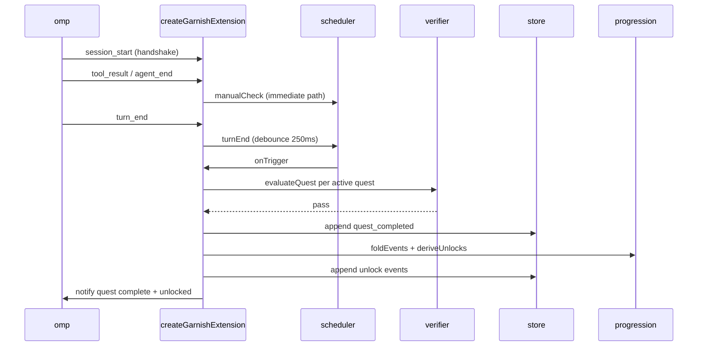

# Pi extension

The Pi extension runs in-process inside the certified `omp` binary and drives everything that happens during a session: it observes live harness events, feeds the verification engine, appends quest completions and derived unlocks to the event log, and notifies the learner. `createGarnishExtension` in `src/extension/index.ts` is the core event wiring and quest evaluation loop. The real composition root in `src/extension/entry.ts` is what `garnish init` bundles with `bun build --target node` into the agent dir for Pi to autoload.

## Directory layout

```
src/extension/
  index.ts    createGarnishExtension: event wiring + evaluation loop + normalizePayload
  entry.ts    real composition root (default export), real probes, wires core + hud + unlocks + tutor
  hud.ts      HUD widget, status line, /quest command
  unlocks.ts  live unlock application + reload
  tutor.ts    ADR-7 tutor bridge (static framing + dynamic context injection)
```

## Key abstractions

| Abstraction | Where | Role |
| --- | --- | --- |
| `createGarnishExtension` | `src/extension/index.ts` | Factory returning `(pi: PiExtensionApi) => GarnishExtensionHandle`. Subscribes to `PI_EVENTS`, records them, schedules evaluation. |
| `GarnishExtensionDeps` | `src/extension/index.ts` | Dependency slice: `graph`, `quests`, `probes`, `store`, `handshake`, `reportedVersion`, `now`, `isoNow`, `paths`, `debounceMs`, `timer`, `onError`. |
| `GarnishExtensionHandle` | `src/extension/index.ts` | `{ isPaused, recordedEvents, evaluateNow }`. |
| `PiExtensionApi` | `src/extension/index.ts` | Structural slice of the Pi surface: `on(event, handler)`. |
| `PiExtensionContext` | `src/extension/index.ts` | `{ hasUI, ui: { notify }, appendEntry? }`. |
| `PiExtensionEvent` | `src/extension/index.ts` | `{ type: string, ... }` event shape from the LOO-118 spike. |

## How it works

`createGarnishExtension(deps)` returns a function that takes the Pi `api` and wires a handler for each name in `PI_EVENTS` (`session_start`, `session_shutdown`, `turn_start`, `turn_end`, `agent_start`, `agent_end`, `tool_call`, `tool_result`, `tool_approval_requested`, `tool_approval_resolved`). Each handler records the event (with a monotonic `seq`, the session id, and a normalized payload) and feeds the scheduler.

On `session_start`, the handler runs the version handshake. Real `session_start` events carry no `version` field (LOO-118 capture 11), so the handshake falls back to `deps.reportedVersion()`, which `src/extension/entry.ts` implements by spawning `--version` against `process.execPath` and the certified binary. A mismatch pauses quests and notifies the learner with the doctor guidance; a clean handshake resets the pause flag and re-arms evaluation.

The scheduler debounces evaluation on `turn_end` (default 250 ms) and runs an immediate path on `agent_end` and `tool_result` to keep the 10-second auto-complete contract. When it fires, `evaluateActiveQuests` reads the event log, folds it, computes the active quests (incomplete, in an unlocked level, prereqs met), and calls `evaluateQuest` on each. Passing quests become `quest_completed` events that are appended to the store. The log is re-folded with the completions, `deriveUnlocks` produces `unlock` events, and those are appended too. Notifications for each completion and unlock are best-effort; state is already durable.



Every handler is wrapped in a top-level try/catch. On any failure the extension calls `pause(reason)` once, notifies the learner that quests are paused (never throws into the session), and reports via `deps.onError`. Evaluation runs on a serialized `evaluating` promise chain so re-entrant triggers do not double-append.

`normalizePayload` copies every event field except `type` into the recorded payload, then derives `assistant_turns` from `messages[]` when no explicit count is present. Only non-empty assistant replies count: a failed provider call (e.g. a 401) still leaves an assistant message with empty content, and the L0 `connect-agent` quest requires one successful round trip. The derivation matches the LOO-139 live observation.

`src/extension/entry.ts` is the real composition root and the default export. It reads `PI_CODING_AGENT_DIR`, and if unset returns `{ active: false, reason }` so the extension stays dormant without breaking chat. Otherwise it calls `loadInstalledState(agentDir)` (synchronous `readFileSync` of the pre-serialized JSON), builds `runtimePaths`, creates the fs event store, builds real probes (`createRealProbes`), and wires four subsystems onto the same `pi`: the core (`createGarnishExtension`), the [HUD](hud.md), [live unlocks](unlocks.md), and the [tutor bridge](tutor.md). Any error during init returns `{ active: false, reason }`; `garnish doctor` is the recovery route.

The synchronous-init constraint is load-bearing. The bundled module must initialize without awaiting (LOO-118 spike: async module init loads as nothing), so `loadInstalledState` and `createFsEventStore` use `readFileSync` and the tutor bridge skips context injection for async stores rather than stalling the model call.

## Integration points

- **CLI state** (`src/cli/state.ts`): `loadInstalledState` and `createFsEventStore` are shared with the CLI, so the extension and `garnish status` read the same `events.jsonl`.
- **Verifier** (`src/verifier/`): `evaluateQuest` runs checks against recorded events and the probes; `createScheduler` debounces evaluation.
- **Progression** (`src/progression/`): `foldEvents` and `deriveUnlocks` drive the completion-to-unlock chain.
- **Adapter** (`src/adapter/`): `handshake`, `parseOmpVersion`, `runtimePaths` back the session-start version check and the unlock gate writes.
- **HUD / unlocks / tutor**: `src/extension/entry.ts` wires all three onto the same `pi`; see [HUD](hud.md), [live unlocks](unlocks.md), and [tutor bridge](tutor.md).

## Entry points for modification

To change which events are observed or how they are recorded, edit `PI_EVENTS` and `record` in `src/extension/index.ts`. To change the evaluation cadence or the immediate-path triggers, edit the scheduler calls in the `session_start`/`turn_end`/`agent_end`/`tool_result` branches. To change how the real composition root binds to the machine (probes, version probe, gate effects), edit `src/extension/entry.ts`.

## Key source files

| File | Role |
| --- | --- |
| `src/extension/index.ts` | `createGarnishExtension`, `PI_EVENTS`, `normalizePayload`, evaluation loop. |
| `src/extension/entry.ts` | Real composition root (default export), real probes, wiring of core + hud + unlocks + tutor. |
| `src/extension/hud.ts` | HUD widget, status line, `/quest`; see [HUD](hud.md). |
| `src/extension/unlocks.ts` | Live unlock application and reload; see [live unlocks](unlocks.md). |
| `src/extension/tutor.ts` | Tutor bridge; see [tutor bridge](tutor.md). |

See [HUD](hud.md), [live unlocks](unlocks.md), and [tutor bridge](tutor.md) for the three subsystems wired alongside the core, and [features/quest-verification](../../features/quest-verification.md) for how checks turn into completions.
