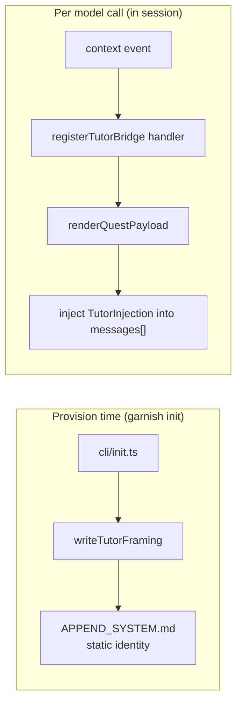

# Tutor bridge

The ADR-7 tutor bridge in `src/extension/tutor.ts` makes the agent the learner's tutor. It has two seams split by change rate: a static identity framing written to `APPEND_SYSTEM.md` at provision time, and a dynamic active-quest payload injected per model call through the Pi `context` event. The static seam sets the tutor's stance; the dynamic seam keeps the active quest in front of the model without persisting anything to disk.

## Directory layout

```
src/extension/
  tutor.ts    TUTOR_FRAMING, writeTutorFraming, renderQuestPayload, registerTutorBridge
  entry.ts    calls registerTutorBridge with graph/quests/store
  ../cli/init.ts   calls writeTutorFraming at provision time
```

## Key abstractions

| Abstraction | Where | Role |
| --- | --- | --- |
| `TutorDeps` | `src/extension/tutor.ts` | Dependency slice: `graph`, `quests`, `store`, `hintPolicy?`, `maxPayloadBytes?`. |
| `TutorHandle` | `src/extension/tutor.ts` | `{ renderPayload, lastInjected }`. |
| `TutorInjection` | `src/extension/tutor.ts` | `{ role: "user", content, garnish: "tutor-context" }` appended to a `context` event's `messages[]`. |
| `TutorContextEvent` | `src/extension/tutor.ts` | `{ type: "context", messages: unknown[] }` slice of the Pi context event. |
| `TutorProvisionEffects` | `src/extension/tutor.ts` | `{ writeFile }` for the provision-time seam. |
| `TUTOR_FRAMING` | `src/extension/tutor.ts` | Static identity text appended to `APPEND_SYSTEM.md`. |

## How it works

The static seam is `writeTutorFraming(agentDir, effects)`. It writes `TUTOR_FRAMING` to `{agent_dir}/APPEND_SYSTEM.md`. The framing tells the model that this harness is a guided learning environment, that it is also the learner's tutor, and that it must never mark quests complete or claim a quest passed (quest completion is verified mechanically by Garnish from real events and artifacts). When asked whether a quest is done, the model should point the learner to the quest log (`/quest`) or `garnish status`. `writeTutorFraming` is called by `src/cli/init.ts` during `garnish init`, so the framing is in place before the first session.

The dynamic seam is `registerTutorBridge(pi, deps)`. It subscribes a handler to the Pi `context` event, which fires per model call with a `messages[]` array the handler may append to. The handler reads the store, folds it synchronously, calls `renderQuestPayload`, and pushes a `TutorInjection` onto `messages[]`. The synchronous-fold constraint is load-bearing: if `deps.store.readEvents()` returns a `Promise` (an async store), the handler skips injection rather than stalling the model call. The fs-backed store from `src/cli/state.ts` is synchronous, so the real extension always injects.

`renderQuestPayload` produces a compact text payload: a header reminding the model not to self-certify, the active quest title/id/level/XP, progress (`<done>/<total> required quests done in this level; total XP <n>`), the quest instructions, a numbered list of acceptance checks (`describeTutorCheck` maps each check type to a tutor-facing verb), and the hint policy. The payload is bounded to ~1 KB (`DEFAULT_MAX_PAYLOAD_BYTES = 1024`). When it overshoots, the description is trimmed first (checks and progress are the load-bearing content); if it still overshoots, the payload is hard-truncated.

The hint policy is opt-in by default: offer a hint only when the learner asks, because opening hints affects the No-Hint Clear badge. `TutorDeps.hintPolicy` overrides the default text.



`activeQuest` (shared shape with the HUD) finds the first required, incomplete quest in an unlocked level whose prereqs are all complete. When there is no active quest, `renderQuestPayload` returns a short "all required quests complete" line with the XP total, so the model still gets a Garnish context event.

## Integration points

- **CLI init** (`src/cli/init.ts`): calls `writeTutorFraming` at provision time, passing its `InitFsEffects.writeFile`.
- **Extension entry** (`src/extension/entry.ts`): calls `registerTutorBridge` with the shared graph, quests, and store.
- **Progression** (`src/progression/`): `foldEvents` produces the state `renderQuestPayload` reads.
- **Core** (`src/core/`): `Quest` and its `checks` shape the payload content.

## Entry points for modification

To change the static identity framing, edit `TUTOR_FRAMING`. To change the dynamic payload content or byte budget, edit `renderQuestPayload` (and `DEFAULT_MAX_PAYLOAD_BYTES` / `DEFAULT_HINT_POLICY`). To change the injection trigger or the async-skip rule, edit the `context` handler in `registerTutorBridge`.

## Key source files

| File | Role |
| --- | --- |
| `src/extension/tutor.ts` | `TUTOR_FRAMING`, `writeTutorFraming`, `renderQuestPayload`, `registerTutorBridge`. |
| `src/cli/init.ts` | Calls `writeTutorFraming` during `garnish init`. |
| `src/extension/entry.ts` | Calls `registerTutorBridge` at extension load. |

See [Pi extension](index.md) for the core the tutor bridge sits alongside, and [design decisions](../../background/design-decisions.md) (ADR-7) for the rationale behind the two-seam split.
