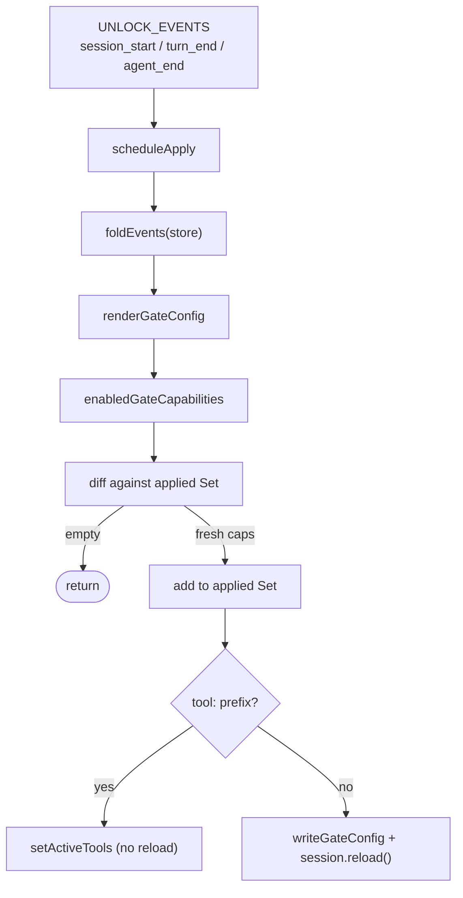

# Live unlocks

The live unlock flow in `src/extension/unlocks.ts` turns unlock events in `events.jsonl` into actual harness capability changes during a session. Some surfaces apply live without a reload; others are baked into the generated gate config and require a session reload to take effect. A `Set` of already-applied capabilities guarantees each capability is applied exactly once, and the flow is monotonic by construction.

## Directory layout

```
src/extension/
  unlocks.ts   registerLiveUnlocks, /unlock command, apply-once flow
  entry.ts     calls registerLiveUnlocks with graph/quests/store/runtimePaths/gateEffects/now
```

## Key abstractions

| Abstraction | Where | Role |
| --- | --- | --- |
| `UnlockPi` | `src/extension/unlocks.ts` | Pi surface slice: `on` + `registerCommand`. |
| `LiveUnlockDeps` | `src/extension/unlocks.ts` | Dependency slice: `graph`, `quests?`, `store`, `runtimePaths`, `gateEffects`, `catalog?`, `now`. |
| `LiveUnlockHandle` | `src/extension/unlocks.ts` | `{ applyUnlocks, appliedCapabilities, reloadCount }`. |
| `UnlockSessionControl` | `src/extension/unlocks.ts` | Session surface slice: `getActiveTools`, `setActiveTools`, `reload`. |
| `UnlockCommandSpec` | `src/extension/unlocks.ts` | `{ description, handler }` for the `/unlock` slash command. |

## How it works

`registerLiveUnlocks(pi, deps)` subscribes a handler to `UNLOCK_EVENTS` (`session_start`, `turn_end`, `agent_end`). Each handler stashes the latest context (which carries `session`) and schedules `applyUnlocksOnce` on a serialized `applying` promise chain.

`applyUnlocksOnce` folds the store, renders the gate config with `renderGateConfig`, and asks `enabledGateCapabilities` for the full set of capabilities the current unlock set enables. It diffs that against the `applied` `Set` and returns early when there is nothing fresh. Fresh capabilities are added to `applied` before any side effect, so a failure mid-apply cannot re-trigger the same capability. The fresh list is then split by the `tool:` prefix:

- **Live tools** (capabilities starting with `tool:`) are applied by merging the tool names into the session's active tools via `setActiveTools` (sorted, deduped with the current set). No reload.
- **Config-baked surfaces** (everything else: `context`, `extensions`, `mcp`, `skills`, `subagents`, `tool:bash`, `tool:file`, `tool:shell` as configured) are written with `writeGateConfig`, then the session is reloaded. State lives in the Garnish store, not session entries, so it survives the reload (the spike showed `appendEntry` right before `reload()` is not durable headless).



The `/unlock` slash command parses `--all` / `--level <id|N>` (or bare `all` / `level <id>`), calls `unlockCommand` from `src/cli/index.ts` to append the unlock events, then schedules `applyUnlocksOnce` and awaits it. A final notify reports the unlocked levels and feature count. Failures fall back to a message pointing at the CLI `garnish unlock`.

Monotonicity is enforced at three layers (see [patterns and conventions](../../how-to-contribute/patterns-and-conventions.md)): the adapter detects regressions across rendered configs, this module's `applied` `Set` only ever grows, and `unlock --all` is checked for stock parity. Here the `applied` `Set` is the load-bearing guard: capabilities are only ever added, so a reload or a re-render cannot strip something already applied.

## Integration points

- **Adapter** (`src/adapter/`): `renderGateConfig`, `enabledGateCapabilities`, `writeGateConfig`, `v1GateCatalog` produce and apply the gate config.
- **CLI** (`src/cli/index.ts`): `unlockCommand` backs the `/unlock` slash command's event append.
- **Progression** (`src/progression/`): `foldEvents` produces the unlock set the flow renders from.
- **Extension entry** (`src/extension/entry.ts`): calls `registerLiveUnlocks` with the shared graph, store, `runtimePaths`, and real `GateConfigEffects`.

## Entry points for modification

To change which surfaces reload versus apply live, modify the `tool:`/non-`tool:` split in `applyUnlocksOnce`. To change the event cadence, edit `UNLOCK_EVENTS`. To change the `/unlock` slash-command surface, edit the `UnlockCommandSpec` handler (and `parseUnlockArgs` for new flags).

## Key source files

| File | Role |
| --- | --- |
| `src/extension/unlocks.ts` | `registerLiveUnlocks`, apply-once flow, `/unlock` command. |
| `src/extension/entry.ts` | Wires `registerLiveUnlocks` with real deps. |

See [Pi extension](index.md) for the core that appends the unlock events this flow consumes, [features/capability-gating](../../features/capability-gating.md) for how gates map to harness surfaces, and [systems/adapter](../adapter.md) for the gate catalog and config rendering.
