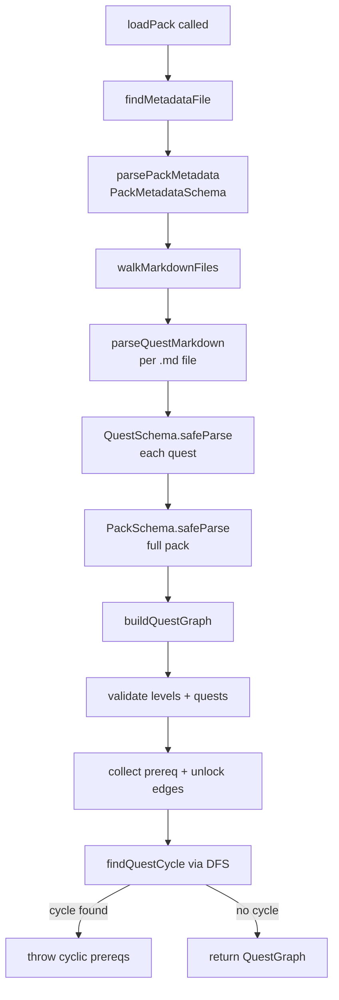

# Pack loader

The loader discovers quest packs on disk, parses their metadata and quest markdown, validates everything against the Zod schemas in `src/core`, and builds a `QuestGraph` with prerequisite and unlock edges plus cycle detection. It is the bridge between the human-authored pack files under `packs/` and the in-memory graph the progression and verification engines consume.

## Directory layout

```
src/loader/
  index.ts   discoverPacks, loadPacks, loadPack, buildQuestGraph, toGraphJSON
```

## Key abstractions

| Type | File | Description |
|------|------|-------------|
| `QuestGraph` | `src/loader/index.ts` | The validated, graph-shaped pack: metadata, levels, quests, node maps, prereq edges, unlock edges, known feature IDs. |
| `PackDiscovery` | `src/loader/index.ts` | A found pack directory and its metadata file path plus format (yaml or json). |
| `LoadPackOptions` | `src/loader/index.ts` | Options for `loadPack`/`loadPacks`, currently just `knownFeatureIds` for cross-pack feature validation. |
| `QuestPrereqEdge` | `src/loader/index.ts` | A directed edge `{ from, to }` representing a quest prerequisite. |
| `UnlockEdge` | `src/core` | A `{ quest, feature }` pair recording which quest unlocks which feature, re-exported through the graph. |

## How it works

`discoverPacks` walks each configured directory, checks for a metadata file at the root or in immediate subdirectories, and returns one `PackDiscovery` per pack. A metadata file is one of `pack.yml`, `pack.yaml`, or `pack.json`; having more than one in a directory is an error. Directories starting with `.` are skipped.

`loadPack` resolves the pack directory, finds and parses the metadata file, then walks the directory tree for `.md` quest files. Each quest file is parsed by `parseQuestMarkdown`, which expects a leading YAML frontmatter block delimited by `---` lines and treats the prose body after the frontmatter as the quest `description`. The parsed frontmatter plus description is run through `QuestSchema.safeParse`, and on success the quests are combined with metadata and run through `PackSchema.safeParse`. Schema failures throw with the file-relative path and formatted Zod issues so authoring errors point at the right file.

`buildQuestGraph` takes the validated `Pack` and builds the graph. It checks for duplicate level and quest IDs, verifies every quest's `level` references a known level, verifies every level's `quests` list points at quests assigned to that level, and verifies every quest prereq and unlock feature references a known target. It then collects prereq edges from `quest.prereqs` and unlock edges from `quest.unlocks`, and runs `findQuestCycle` to detect cyclic prerequisites via DFS. On a cycle it throws with the offending path joined by ` -> `. Levels are sorted by `order` then ID, quests by ID, and edges by their endpoint IDs, so the output is deterministic.

`toGraphJSON` serializes a `QuestGraph` into a canonical JSON string with sorted keys and no `undefined` values, which is what gets written to `garnish/graph.json` during onboarding.



## Integration points

- **Imports from:** `src/core` (PackMetadataSchema, PackSchema, QuestSchema, UnlockEdgeSchema, FeatureIdSchema, and the domain types), `yaml` for parsing, `node:fs/promises` and `node:path`.
- **Imported by:** `src/cli/init.ts` (copies packs into the agent dir then loads them to build the graph and quests JSON), and by the loader tests.
- **Tested by:** `tests/loader/` and `tests/packs/` (graph building, cycle detection, frontmatter parsing, pack discovery).

## Entry points for modification

To add a quest, create a `.md` file with YAML frontmatter (id, level, prereqs, unlocks, checks, xp, required) in an existing pack directory under `packs/`; the prose body becomes the description. To add a new pack, create a directory with a `pack.yml` (or `pack.yaml` / `pack.json`) and one or more quest `.md` files, then add the directory to the configured pack roots in `src/cli/init.ts`. New frontmatter fields require a schema change in `src/core` first; see [domain model](../primitives/domain-model.md) and [curriculum](../features/curriculum.md).

## Key source files

| File | Purpose |
|------|---------|
| `src/loader/index.ts` | Discovery, parsing, schema validation, graph building, cycle detection, canonical serialization. |
