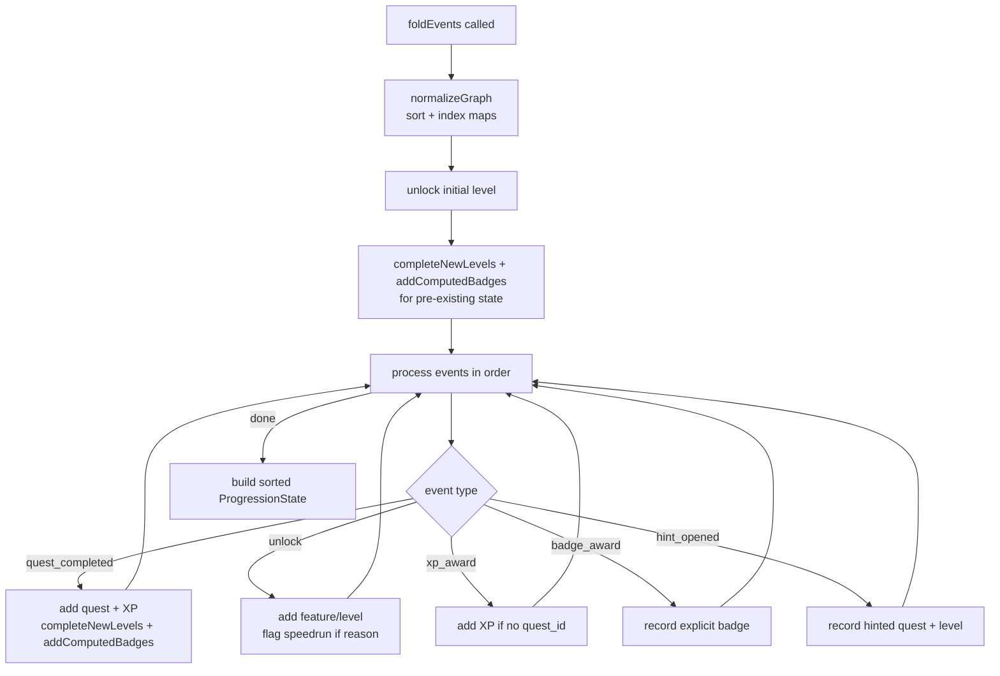

# Progression engine

The progression engine folds the append-only event log into a `ProgressionState` and derives the unlock events that follow from level completions. It is a set of pure functions: given the event list and the progression graph, it produces the same state every time, so state is reconstructable from the log alone. XP, level completion, badges, and unlock derivation all live here.

## Directory layout

```
src/progression/
  index.ts   foldEvents, deriveUnlocks, replayProgression, normalizeGraph, badge computation
```

## Key abstractions

| Type | File | Description |
|------|------|-------------|
| `ProgressionGraph` | `src/progression/index.ts` | The graph the fold runs against: levels, quests, and optional unlock edges. |
| `ProgressionState` | `src/progression/index.ts` | The folded snapshot: completed quests, XP total, completed levels, current level, unlock set, badges, hints opened, level completions. |
| `ProgressionUnlockSet` | `src/progression/index.ts` | The features and levels currently unlocked, consumed by the gate renderer. |
| `LevelCompletion` | `src/progression/index.ts` | Record that a level completed: level ID, timestamp, and the source quest that triggered it. |
| `ProgressionBadgeAward` | `src/progression/index.ts` | A badge award: badge name plus optional level or quest scope. |
| `NormalizedGraph` | `src/progression/index.ts` | Internal precomputed index maps (quests by ID, quests by level, required quests, next level, level order) used by the fold. |
| `ProgressionEvent` | `src/core` | The append-only event union (quest_completed, unlock, xp_award, badge_award, hint_opened), defined in core. |

## How it works

### foldEvents

`foldEvents` takes the event list and a `ProgressionGraph` and returns a `ProgressionState`. It starts by normalizing the graph via `normalizeGraph`, which sorts levels by order then ID, sorts quests by level order then ID, and builds index maps for quests by ID, quest IDs by level, required quest IDs by level and overall, unlock edges by level, and the next level for each level. The initial level is unlocked up front so the learner can start.

The fold processes events in order. A `quest_completed` event adds the quest to the completed set, adds its XP (from the graph quest or the event's own XP), then runs `completeNewLevels` and `addComputedBadges`. An `unlock` event adds the target feature or level to the unlocked set; if the reason is `speedrun` or `cheat` it sets `usedSpeedrunPath` and recomputes badges. An `xp_award` event with no `quest_id` adds to the XP total. A `badge_award` event records an explicit badge. A `hint_opened` event records the quest and level as hinted.

`completeNewLevels` scans levels in order and marks a level complete when every required quest in that level is done, recording the timestamp and source quest from the triggering event. When a level's required quests all completed without any hints, it awards a `no_hint_clear` badge for that level. `addComputedBadges` awards `completionist` per level (all quests in the level done, not just required ones), a global `completionist` when every quest in the graph is done, and `speedrunner` when the learner used a speedrun or cheat path and still completed all required quests. The `usedSpeedrunPath` flag is what distinguishes a speedrun completion from a clean one.

The returned state sorts all ID lists deterministically using the normalized graph's level order, so identical inputs produce byte-identical state.



### deriveUnlocks

`deriveUnlocks` computes the `unlock` events that should be appended after a fold. It walks the state's level completions in order, and for each completed level computes the features unlocked by that level: the level's own `unlocks`, plus the `unlocks` of every completed quest in the level, plus any `unlockEdges` whose quest is completed. Features not already in the unlock set become `unlock` events with reason `quest_completed` and the source level and quest recorded. It also unlocks the next level in order if it is not already unlocked. The result is the list of events for the caller to append to the log.

### replayProgression and normalizeGraph

`replayProgression` folds the same events twice and compares the JSON, which is a self-check that the fold is deterministic. `normalizeGraph` is the shared setup used by both `foldEvents` and `deriveUnlocks`; it is also where the sort order that the rest of the engine depends on is established.

## Integration points

- **Imports from:** `src/core` (Badge, FeatureId, LevelId, ProgressionEvent, QuestCompletedEvent, QuestId, UnlockEvent types).
- **Imported by:** `src/cli/index.ts` (the `status`, `quest`, and `unlock` command cores fold events to render state and derive unlocks), `src/cli/init.ts` (folds events to apply speedrun unlocks during onboarding), `src/extension/index.ts` (folds events and derives unlocks when evaluating active quests).
- **Tested by:** `tests/progression/` (fold scenarios, unlock derivation, badge computation, determinism).

## Entry points for modification

To change badge logic, modify `addComputedBadges` or `completeNewLevels` in `src/progression/index.ts`; new badge names also need a schema entry in `src/core`. To change unlock derivation, modify `deriveUnlocks` or the `featuresUnlockedByLevel` helper. The fold itself is the single source of truth, so any state-shape change needs matching updates in the consumers that read `ProgressionState`. See [progression events](../primitives/progression-events.md) for the event schema and [capability gating](../features/capability-gating.md) for how the unlock set feeds the gate renderer.

## Key source files

| File | Purpose |
|------|---------|
| `src/progression/index.ts` | `foldEvents`, `deriveUnlocks`, `replayProgression`, `normalizeGraph`, badge and level-completion computation. |
