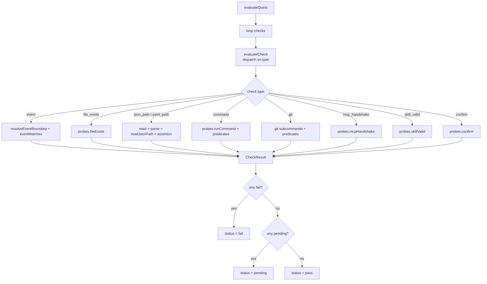

# Verification engine

The verifier evaluates the check DSL against live harness events and on-demand probes. Each quest carries a list of checks drawn from a closed set of nine types, and the verifier dispatches each check to a type-specific evaluator, aggregates pass/fail/pending into a quest result, and exposes a scheduler that debounces evaluation to harness event cadence. It is the engine that decides a quest is genuinely complete.

## Directory layout

```
src/verifier/
  index.ts   evaluateQuest, evaluateCheck, scheduler, JSONPath, predicates, event matching
```

## Key abstractions

| Type | File | Description |
|------|------|-------------|
| `Probes` | `src/verifier/index.ts` | Dependency-injected on-demand probes: `fileExists`, `readFile`, `runCommand`, `mcpHandshake`, `skillValid`, `confirm`. |
| `EvaluationContext` | `src/verifier/index.ts` | Everything a check evaluation needs: probes, events, current session ID, path templates, event refs, MCP servers, command cwd. |
| `VerifierEvent` | `src/verifier/index.ts` | A normalized event: name, optional sessionId, seq, payload. |
| `CheckResult` | `src/verifier/index.ts` | A check outcome: `pass`, `fail`, or `pending`, plus typed evidence. |
| `QuestResult` | `src/verifier/index.ts` | Aggregated quest outcome with per-check results and counts. |
| `VerifierScheduler` | `src/verifier/index.ts` | Debounced trigger surface: `questActivated`, `turnEnd`, `manualCheck`, `dispose`. |
| `Check` | `src/core/checks.ts` | The discriminated union of the nine check types, defined in core and consumed here. |

## How it works

### Quest and check evaluation

`evaluateQuest` loops a quest's checks, calls `evaluateCheck` on each, and aggregates. A single `fail` fails the quest; otherwise a `pending` leaves the quest pending; all `pass` passes the quest. The result carries per-check evidence and passed/failed/pending counts.

`evaluateCheck` is a switch on `check.type` dispatching to the right evaluator. The nine types are: `event` (match on event predicates), `file_exists`, `json_path`, `yaml_path`, `command` (exit code plus stdout/stderr predicates), `git` (commit_count, clean_tree, branch_exists, dirty, diff_contains, file_restored), `mcp_handshake`, `skill_valid` (frontmatter parse plus discovery), and `confirm` (explicit learner self-confirmation). There are no LLM-graded checks in v1.

### Event matching

`evaluateEventCheck` resolves an optional `after` boundary, optionally constrains to the same session via `sameSession`, then scans events from the boundary forward for a match. The boundary is either a quest ID (the event after which that quest completed), or a `{ ref, event }` pair resolved against `ctx.eventRefs`. `eventMatches` compares event name and payload fields, with field aliases that absorb the differences between live Pi events and fixtures: `tool` / `toolName` / `tool_name` for the tool field, `success` (fixture shorthand) versus `isError` / `is_error` (live `tool_result`) for outcome, and `min_assistant_turns` reading from `assistant_turns` / `assistantTurns`. A `count` predicate turns the match into an integer predicate; otherwise the first match passes.



### Structured path checks

`evaluateStructuredPathCheck` handles `json_path` and `yaml_path`. It reads and parses the file (JSON or YAML), runs `readJsonPath` against the parsed value, then applies an assertion. JSONPath parsing supports `$` roots, dot notation, bracket notation with numeric indexes, quoted string keys, and `*` wildcards. Wildcards fan out to all array elements or object values, and the assertion is satisfied if any matched value passes. Assertions are `exists`, `missing`, `non_empty`, `equals`, `contains`, and `matches` (regex).

### Predicates and templates

`matchesStringPredicate` handles string predicates: literal equality, `equals`, `contains`, `starts_with`, `ends_with`, `regex`, and `one_of`. `matchesIntPredicate` handles integer predicates: literal equality, `equals`, `min`, `max`. Path templates like `{agent_dir}` and `{sandbox}` are resolved by `resolveTemplate` against `ctx.paths` before any file or command probe runs.

### Scheduler

`createScheduler` returns a `VerifierScheduler` that controls when evaluation fires. `turnEnd` is debounced by `debounceMs` (default 250ms) so a burst of turn-end events collapses into one evaluation. `manualCheck` (the `/quest check` command) cancels any pending debounce and fires immediately. `questActivated` fires immediately so a newly active quest gets an initial evaluation. `dispose` clears any pending timer.

## Integration points

- **Imports from:** `src/core` (Check, EventCheck, EventMatch, EventAfter, GitCheck, Assertion, IntPredicate, StringPredicate types), `yaml` for YAML path checks.
- **Imported by:** `src/extension/index.ts` (calls `evaluateQuest` for active quests on each scheduler trigger), `src/extension/hud.ts` (the `/quest check` slash command drives `manualCheck`).
- **Tested by:** `tests/verifier/` (event matching, JSONPath, predicates, scheduler, each check type).

## Entry points for modification

To add a check type, add it to the `CheckSchema` discriminated union and `CHECK_TYPES` in `src/core/checks.ts`, then add a `case` to the `evaluateCheck` switch in `src/verifier/index.ts` and a matching evaluator function. Add fixture-driven tests under `tests/verifier/`. See [quest verification](../features/quest-verification.md) for the feature-level view and [domain model](../primitives/domain-model.md) for the check schema primitives.

## Key source files

| File | Purpose |
|------|---------|
| `src/verifier/index.ts` | `evaluateQuest`, `evaluateCheck`, all check-type evaluators, JSONPath, predicates, scheduler. |
| `src/core/checks.ts` | The `Check` discriminated union, `CHECK_TYPES`, and per-type schemas (a primitive, see [domain model](../primitives/domain-model.md)). |
